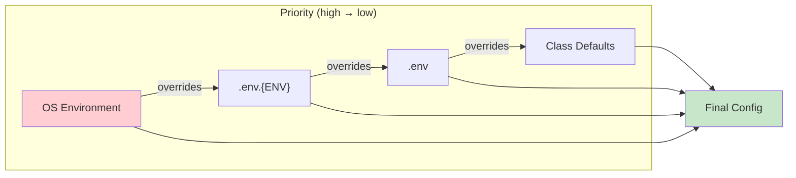

# Settings

All configuration in one file: `src/settings.py`.

## Configuration Flow



## Basic Setup

```python
# src/settings.py
from core.config import Settings, PydanticField, configure

class AppSettings(Settings):
    # App
    app_name: str = "My API"
    app_version: str = "1.0.0"
    
    # Auth (required if using authentication)
    user_model: str = "src.apps.users.models.User"
    
    # Custom fields
    stripe_key: str = PydanticField(default="", description="Stripe API key")

settings = configure(settings_class=AppSettings)
```

## Environment Files

Priority (highest to lowest):

1. OS environment variables
2. `.env.{ENVIRONMENT}` (e.g., `.env.production`)
3. `.env`
4. Class defaults

```env
# .env
DATABASE_URL=postgresql+asyncpg://localhost/mydb
SECRET_KEY=dev-secret
DEBUG=true
```

```env
# .env.production
ENVIRONMENT=production
DEBUG=false
DATABASE_POOL_SIZE=20
```

## Available Settings

### Application

| Setting | Default | Description |
|---------|---------|-------------|
| `app_name` | "Core API" | App name in docs |
| `app_version` | "0.1.0" | Version string |
| `environment` | "development" | dev/staging/production |
| `debug` | `False` | Debug mode |
| `secret_key` | random | App secret key |

### Database

| Setting | Default | Description |
|---------|---------|-------------|
| `database_url` | sqlite | Connection string |
| `database_echo` | `False` | Log SQL queries |
| `database_pool_size` | 5 | Connection pool size |
| `database_max_overflow` | 10 | Extra connections |
| `auto_create_tables` | `False` | Auto-create tables on startup |

### API

| Setting | Default | Description |
|---------|---------|-------------|
| `api_prefix` | "/api/v1" | API URL prefix |
| `docs_url` | "/docs" | Swagger UI path |
| `redoc_url` | "/redoc" | ReDoc path |

### Auth

| Setting | Default | Description |
|---------|---------|-------------|
| `user_model` | `None` | User model path (required for auth) |
| `auth_secret_key` | from `secret_key` | JWT signing key |
| `auth_algorithm` | "HS256" | JWT algorithm |
| `auth_access_token_expire_minutes` | 30 | Access token TTL |
| `auth_refresh_token_expire_days` | 7 | Refresh token TTL |

### CORS

| Setting | Default | Description |
|---------|---------|-------------|
| `cors_origins` | `["*"]` | Allowed origins |
| `cors_allow_credentials` | `False` | Allow cookies |
| `cors_allow_methods` | `["*"]` | Allowed methods |

### Server

| Setting | Default | Description |
|---------|---------|-------------|
| `host` | "0.0.0.0" | Bind address |
| `port` | 8000 | Port |
| `workers` | 1 | Worker processes |
| `reload` | `True` | Hot reload |

## Access Settings

```python
from core.config import get_settings

settings = get_settings()
print(settings.database_url)
print(settings.app_name)
```

## Custom Fields

```python
class AppSettings(Settings):
    # With validation
    max_upload_mb: int = PydanticField(
        default=10,
        ge=1,
        le=100,
        description="Max upload size in MB"
    )
    
    # List from JSON env var
    allowed_ips: list[str] = PydanticField(
        default=["127.0.0.1"],
        description="Allowed IP addresses"
    )
```

```env
# .env
MAX_UPLOAD_MB=50
ALLOWED_IPS='["10.0.0.1", "10.0.0.2"]'
```

## CLI Settings

For `core` CLI commands:

```python
class AppSettings(Settings):
    # Required for CLI
    app_module: str = "src.main"           # Entry point module
    migrations_dir: str = "./migrations"    # Migrations folder
    app_label: str = "main"                 # App label for migrations
```

## Next

- [Models](03-models.md) — Database models
- [Auth](05-auth.md) — Authentication settings
