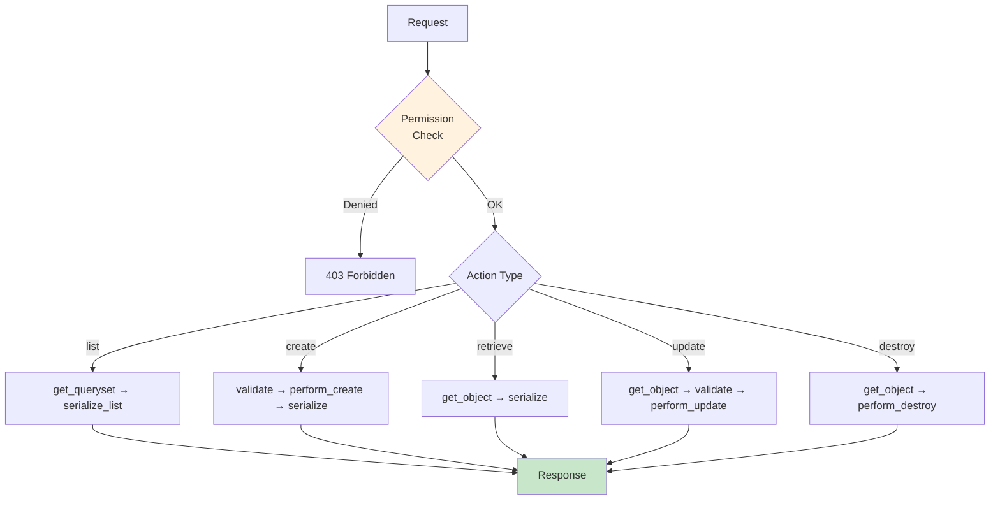

# ViewSets

Auto-generate CRUD endpoints from models.

## Request Lifecycle



## Basic ViewSet

```python
from strider import ModelViewSet
from .models import Post

class PostViewSet(ModelViewSet):
    model = Post
```

Generated endpoints:

| Method | Path | Action |
|--------|------|--------|
| GET | /posts/ | `list` |
| POST | /posts/ | `create` |
| GET | /posts/{id} | `retrieve` |
| PUT | /posts/{id} | `update` |
| PATCH | /posts/{id} | `partial_update` |
| DELETE | /posts/{id} | `destroy` |

## Schemas e Serializer

Controle de entrada/saída: use **serializer_class** (recomendado) ou **input_schema**/**output_schema** direto no ViewSet. O Serializer é o ponto único de contrato; o Router obtém os schemas dele.

```python
from strider import ModelViewSet
from .models import Post
from .serializers import PostSerializer

class PostViewSet(ModelViewSet):
    model = Post
    serializer_class = PostSerializer
```

Sem Serializer:

```python
from strider import ModelViewSet, InputSchema, OutputSchema
from .models import Post

class PostInput(InputSchema):
    title: str
    content: str
    published: bool = False

class PostOutput(OutputSchema):
    id: int
    title: str
    content: str
    published: bool
    created_at: datetime

class PostViewSet(ModelViewSet):
    model = Post
    input_schema = PostInput
    output_schema = PostOutput
```

Ver [Serializers](13-serializers.md).

## Permissions

```python
from strider import ModelViewSet
from strider.permissions import AllowAny, IsAuthenticated, IsAdminUser

class PostViewSet(ModelViewSet):
    model = Post
    
    # Default for all actions
    permission_classes = [IsAuthenticated]
    
    # Override por ação
    permission_classes_by_action = {
        "list": [AllowAny],
        "retrieve": [AllowAny],
        "create": [IsAuthenticated],
        "update": [IsAuthenticated],
        "destroy": [IsAdminUser],
    }
```

## Custom Actions

```python
from strider import ModelViewSet, action
from fastapi import Response

class PostViewSet(ModelViewSet):
    model = Post
    
    @action(methods=["POST"], detail=True)
    async def publish(self, request, db, **kwargs) -> dict:
        """POST /posts/{id}/publish/"""
        post = await self.get_object(db, **kwargs)
        post.published = True
        await post.save(db)
        return self._serialize_for_response(post)
    
    @action(methods=["GET"], detail=False)
    async def recent(self, request, db) -> list[dict]:
        """GET /posts/recent/"""
        qs = self.get_queryset(db)
        posts = await qs.filter(published=True).order_by("-created_at").limit(5).all()
        return self._serialize_many_for_response(posts)
```

### Opções do @action

```python
@action(
    methods=["POST"],
    detail=True,            # True: /posts/{id}/action/, False: /posts/action/
    url_path="custom-path", # Caminho customizado
    url_name="custom_name", # Nome da rota
    permission_classes=[IsAdminUser],
    input_schema=MyInput,   # Schema do body (opcional)
    output_schema=MyOutput, # Schema da response (opcional)
)
```

### Automatic Route Resolution (No Manual Priority)

Custom actions are now registered with an automatic specificity sorter:

- static paths first (`/posts/list`)
- dynamic paths later (`/posts/{slug}`)
- wildcard/regex patterns last (`/posts/{path:path}`)

This avoids common collisions like `list` being captured by a dynamic `{name}` route.

Optional ViewSet knobs:

```python
class PostViewSet(ModelViewSet):
    model = Post
    # warn | raise | ignore
    route_conflict_policy = "warn"

    # Optional custom sorter:
    # (action_name, url_path, detail) -> tuple
    custom_action_sort_key = staticmethod(
        lambda action_name, url_path, detail: (0, action_name)
    )
```

## Hooks

Hooks do ciclo de vida:

| Hook | Quando |
|------|--------|
| `perform_create_validation(data, db)` | Antes de criar; pode alterar `data`. |
| `after_create(obj, db)` | Depois de criar e salvar. |
| `perform_update_validation(data, instance, db)` | Antes de atualizar. |
| `after_update(obj, db)` | Depois de atualizar e salvar. |

```python
class PostViewSet(ModelViewSet):
    model = Post
    serializer_class = PostSerializer

    async def perform_create_validation(self, data, db):
        data["author_id"] = self.request.user.id
        return data

    async def after_create(self, obj, db):
        await send_notification(f"Post {obj.id} criado")

    async def perform_update_validation(self, data, instance, db):
        data["updated_by_id"] = self.request.user.id
        return data
```

## QuerySet Filtering

```python
class PostViewSet(ModelViewSet):
    model = Post
    
    def get_queryset(self, db):
        """Filter queryset based on request."""
        qs = super().get_queryset(db)
        
        # Only show user's own posts
        if not self.request.user.is_staff:
            qs = qs.filter(author_id=self.request.user.id)
        
        return qs
```

## Paginação

```python
class PostViewSet(ModelViewSet):
    model = Post
    page_size = 20   # padrão por página
    max_page_size = 100  # teto para page_size
```

Query params: `?page=1&page_size=20`

Resposta:

```json
{
  "items": [...],
  "total": 100,
  "page": 1,
  "page_size": 20,
  "pages": 5
}
```

## Read-Only ViewSet

```python
from strider import ReadOnlyModelViewSet

class PostViewSet(ReadOnlyModelViewSet):
    model = Post
    # Only list and retrieve, no create/update/delete
```

## Rotas

Com auto-discovery (recomendado), crie `urls.py` em cada app:

```python
# src/apps/posts/urls.py
from strider import path
from .views import PostViewSet

urlpatterns = [
    path("posts", PostViewSet),
]
```

```python
# src/main.py
from strider import StrideApp

app = StrideApp()  # Carrega installed_apps e urls automaticamente
```

Com Router explícito:

```python
# src/apps/posts/routes.py
from strider import Router
from .views import PostViewSet

router = Router(prefix="/posts", tags=["Posts"])
router.register_viewset("", PostViewSet)
```

Ver [Routing](23-routing.md).

## Próximos passos

- [Criar uma aplicação](00-criar-aplicacao.md) — Guia completo
- [Serializers](13-serializers.md) — Input/Output e Serializer único
- [Auth](05-auth.md) — Autenticação
- [Permissions](08-permissions.md) — Controle de acesso
