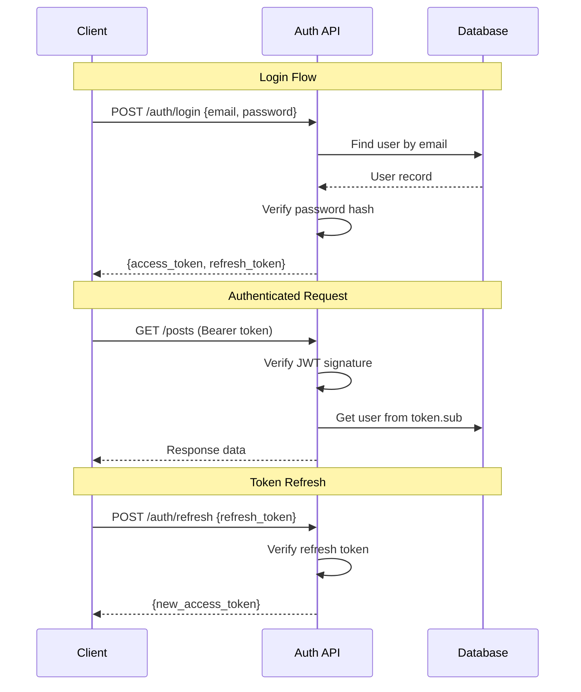
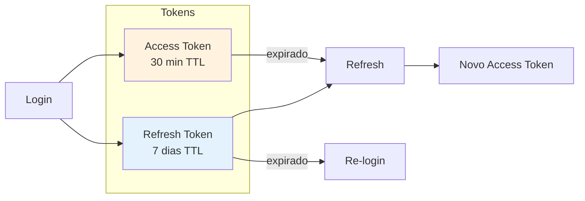

# Authentication

Sistema de autenticação JWT com configuração plug-and-play. Defina `user_model` no Settings e tudo é configurado automaticamente.

## Fluxo de Auth



## Ciclo de Vida dos Tokens



## Configuração Plug-and-Play

```python
# src/settings.py
from core.config import Settings, configure

class AppSettings(Settings):
    # ══════════════════════════════════════════════════════════════════
    # Auth - auto-configurado quando user_model está definido
    # ══════════════════════════════════════════════════════════════════
    user_model: str = "src.apps.users.models.User"
    models_module: str = "src.apps"  # Para carregar relacionamentos
    
    # Tokens (opcional)
    auth_access_token_expire_minutes: int = 30
    auth_refresh_token_expire_days: int = 7
    
    # Password (opcional)
    auth_password_hasher: str = "argon2"
    auth_password_min_length: int = 10
    auth_password_require_uppercase: bool = True
    auth_password_require_digit: bool = True

settings = configure(settings_class=AppSettings)
```

**Zero configuração explícita**: Você NÃO precisa chamar `configure_auth()`. Basta definir `user_model`.

## Settings de Auth

### Tokens e Chaves

| Setting | Tipo | Default | Descrição |
|---------|------|---------|-----------|
| `auth_secret_key` | `str \| None` | `None` | Chave para tokens. Usa `secret_key` se None |
| `auth_algorithm` | `str` | `"HS256"` | Algoritmo JWT: HS256, HS384, HS512, RS256 |
| `auth_access_token_expire_minutes` | `int` | `30` | TTL do access token (minutos) |
| `auth_refresh_token_expire_days` | `int` | `7` | TTL do refresh token (dias) |

### User Model

| Setting | Tipo | Default | Descrição |
|---------|------|---------|-----------|
| `user_model` | `str \| None` | `None` | Path do modelo User. **Obrigatório para auth** |
| `auth_username_field` | `str` | `"email"` | Campo usado como username: email, username, cpf |

### Backends

| Setting | Tipo | Default | Descrição |
|---------|------|---------|-----------|
| `auth_backends` | `list[str]` | `["model"]` | Backends a tentar: model, oauth, ldap, token, api_key |
| `auth_backend` | `str` | `"model"` | Backend padrão |
| `auth_token_backend` | `str` | `"jwt"` | Backend de tokens: jwt, opaque, redis |
| `auth_permission_backend` | `str` | `"default"` | Backend de permissões: default, rbac, abac |

### Password

| Setting | Tipo | Default | Descrição |
|---------|------|---------|-----------|
| `auth_password_hasher` | `str` | `"pbkdf2_sha256"` | Hasher: pbkdf2_sha256, argon2, bcrypt, scrypt |
| `auth_password_min_length` | `int` | `8` | Comprimento mínimo |
| `auth_password_require_uppercase` | `bool` | `False` | Exigir maiúscula |
| `auth_password_require_lowercase` | `bool` | `False` | Exigir minúscula |
| `auth_password_require_digit` | `bool` | `False` | Exigir dígito |
| `auth_password_require_special` | `bool` | `False` | Exigir caractere especial |

### HTTP

| Setting | Tipo | Default | Descrição |
|---------|------|---------|-----------|
| `auth_header` | `str` | `"Authorization"` | Header HTTP para auth |
| `auth_scheme` | `str` | `"Bearer"` | Scheme: Bearer, Basic, Token |
| `auth_warn_missing_middleware` | `bool` | `True` | Warning se middleware não configurado |

## Setup

### 1. Criar User Model

```python
# src/apps/users/models.py
from core.auth import AbstractUser, PermissionsMixin
from core import Field
from sqlalchemy.orm import Mapped

class User(AbstractUser, PermissionsMixin):
    __tablename__ = "users"
    
    # AbstractUser fornece:
    # - id, email, password (hashed), is_active, is_staff, is_superuser
    
    # PermissionsMixin fornece:
    # - groups, user_permissions (relacionamentos M2M)
    
    # Campos customizados
    first_name: Mapped[str | None] = Field.string(max_length=100, nullable=True)
    last_name: Mapped[str | None] = Field.string(max_length=100, nullable=True)
```

### 2. Adicionar Rotas de Auth

```python
# src/apps/users/views.py
from core.auth import AuthViewSet

class AuthViewSet(AuthViewSet):
    pass  # Usa defaults
```

```python
# src/apps/users/routes.py
from core import AutoRouter
from .views import AuthViewSet

auth_router = AutoRouter(prefix="/auth", tags=["Auth"])
auth_router.register("", AuthViewSet)
```

```python
# src/main.py
from core import CoreApp, AutoRouter
from src.apps.users.routes import auth_router

api = AutoRouter(prefix="/api/v1")
api.include_router(auth_router)

app = CoreApp(
    routers=[api],
    middleware=["auth"],  # Habilita middleware de auth
)
```

## Endpoints

| Método | Path | Descrição |
|--------|------|-----------|
| POST | /auth/login | Login, obter tokens |
| POST | /auth/register | Criar conta |
| POST | /auth/refresh | Renovar access token |
| GET | /auth/me | Obter usuário atual |
| POST | /auth/logout | Invalidar tokens |

### Login

```bash
curl -X POST http://localhost:8000/api/v1/auth/login \
  -H "Content-Type: application/json" \
  -d '{"email": "user@example.com", "password": "secret123"}'
```

Resposta:

```json
{
  "access_token": "eyJ...",
  "refresh_token": "eyJ...",
  "token_type": "bearer",
  "user": {
    "id": 1,
    "email": "user@example.com"
  }
}
```

### Register

```bash
curl -X POST http://localhost:8000/api/v1/auth/register \
  -H "Content-Type: application/json" \
  -d '{"email": "new@example.com", "password": "secret123"}'
```

### Request Autenticado

```bash
curl http://localhost:8000/api/v1/posts/ \
  -H "Authorization: Bearer eyJ..."
```

## Proteger Endpoints

```python
from core import ModelViewSet
from core.permissions import IsAuthenticated, AllowAny

class PostViewSet(ModelViewSet):
    model = Post
    permission_classes = [IsAuthenticated]  # Requer auth
    
    permission_classes_by_action = {
        "list": [AllowAny],     # Lista pública
        "retrieve": [AllowAny], # Detalhe público
    }
```

## Acessar Usuário Atual

```python
from core import ModelViewSet

class PostViewSet(ModelViewSet):
    model = Post
    
    async def perform_create(self, instance, validated_data):
        instance.author_id = self.request.user.id
        await instance.save()
```

Ou em qualquer rota:

```python
from fastapi import Depends
from core.auth import get_current_user

@router.get("/me")
async def me(user = Depends(get_current_user)):
    return {"id": user.id, "email": user.email}
```

## Criar Superusuário

```bash
core createsuperuser
# Digite email e senha
```

## Password Hashers

| Hasher | Descrição |
|--------|-----------|
| `pbkdf2_sha256` | Default, seguro, compatível |
| `argon2` | Mais seguro, requer `argon2-cffi` |
| `bcrypt` | Popular, requer `bcrypt` |
| `scrypt` | Resistente a hardware |

```python
class AppSettings(Settings):
    auth_password_hasher: str = "argon2"
```

```bash
# Instalar dependência
pip install argon2-cffi  # para argon2
pip install bcrypt       # para bcrypt
```

## Validação de Senha

```python
class AppSettings(Settings):
    auth_password_min_length: int = 12
    auth_password_require_uppercase: bool = True
    auth_password_require_lowercase: bool = True
    auth_password_require_digit: bool = True
    auth_password_require_special: bool = True
```

## AuthViewSet Customizado

```python
from core.auth import AuthViewSet
from core import action

class CustomAuthViewSet(AuthViewSet):
    
    @action(detail=False, methods=["POST"])
    async def change_password(self, request) -> dict:
        user = request.user
        data = await request.json()
        
        if not user.check_password(data["old_password"]):
            raise HTTPException(400, "Senha incorreta")
        
        user.set_password(data["new_password"])
        await user.save()
        return {"status": "ok"}
    
    @action(detail=False, methods=["POST"])
    async def forgot_password(self, request) -> dict:
        data = await request.json()
        # Implementar lógica de reset
        return {"status": "email enviado"}
```

## Middleware

### Shortcuts

```python
class AppSettings(Settings):
    middleware: list[str] = [
        "auth",           # AuthenticationMiddleware (requer auth)
        "optional_auth",  # OptionalAuthenticationMiddleware (auth opcional)
    ]
```

### Diferença

| Middleware | Comportamento |
|------------|---------------|
| `auth` | Requer autenticação, retorna 401 se não autenticado |
| `optional_auth` | Carrega usuário se token presente, permite anônimo |

## Próximos Passos

- [Auth Backends](06-auth-backends.md) — Backends de autenticação
- [Permissions](08-permissions.md) — Controle de acesso
- [Admin](40-admin.md) — Painel administrativo
- [Settings](02-settings.md) — Todas as configurações
