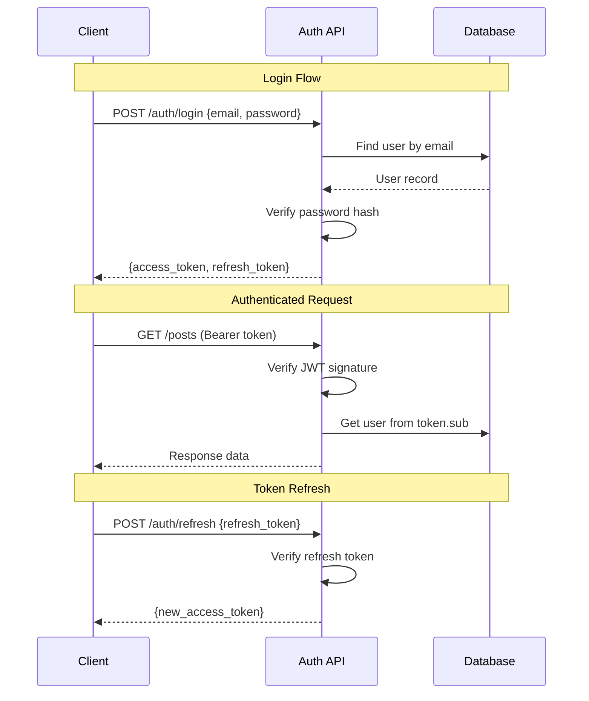
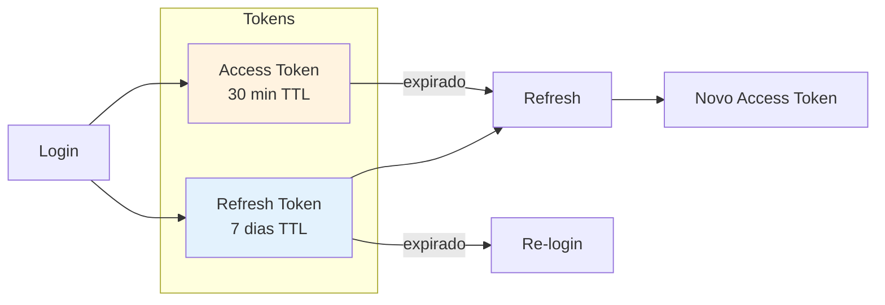

# Authentication

Sistema de autenticação JWT com configuração plug-and-play. Defina `user_model` no Settings e tudo é configurado automaticamente.

## Fluxo de Auth


```mermaid
sequenceDiagram
    participant C as Client
    participant A as Auth API
    participant DB as Database
    
    Note over C,DB: Login Flow
    C->>A: POST /auth/login {email, password}
    A->>DB: Find user by email
    DB-->>A: User record
    A->>A: Verify password hash
    A-->>C: {access_token, refresh_token}
    
    Note over C,DB: Authenticated Request
    C->>A: GET /posts (Bearer token)
    A->>A: Verify JWT signature
    A->>DB: Get user from token.sub
    A-->>C: Response data
    
    Note over C,DB: Token Refresh
    C->>A: POST /auth/refresh {refresh_token}
    A->>A: Verify refresh token
    A-->>C: {new_access_token}
```

## Ciclo de Vida dos Tokens


```mermaid
flowchart LR
    subgraph Tokens
        AT[Access Token<br/>30 min TTL]
        RT[Refresh Token<br/>7 dias TTL]
    end
    
    LOGIN[Login] --> AT
    LOGIN --> RT
    
    AT --> |expirado| REFRESH[Refresh]
    RT --> REFRESH
    REFRESH --> AT2[Novo Access Token]
    
    RT --> |expirado| LOGIN2[Re-login]
    
    style AT fill:#fff3e0
    style RT fill:#e3f2fd
```

## Configuração Plug-and-Play

```python
# src/settings.py
from strider.config import Settings, configure

class AppSettings(Settings):
    # ══════════════════════════════════════════════════════════════════
    # Auth - auto-configurado quando user_model está definido
    # ══════════════════════════════════════════════════════════════════
    user_model: str = "src.apps.users.models.User"
    models_module: str = "src.apps"  # Para carregar relacionamentos
    
    # Tokens (opcional)
    auth_access_token_expire_minutes: int = 30
    auth_refresh_token_expire_days: int = 7
    
    # Password (opcional)
    auth_password_hasher: str = "argon2"
    auth_password_min_length: int = 10
    auth_password_require_uppercase: bool = True
    auth_password_require_digit: bool = True

settings = configure(settings_class=AppSettings)
```

**Zero configuração explícita**: Você NÃO precisa chamar `configure_auth()`. Basta definir `user_model`.

## Settings de Auth

### Tokens e Chaves

| Setting | Tipo | Default | Descrição |
|---------|------|---------|-----------|
| `auth_secret_key` | `str \| None` | `None` | Chave para tokens. Usa `secret_key` se None |
| `auth_algorithm` | `str` | `"HS256"` | Algoritmo JWT: HS256, HS384, HS512, RS256 |
| `auth_access_token_expire_minutes` | `int` | `30` | TTL do access token (minutos) |
| `auth_refresh_token_expire_days` | `int` | `7` | TTL do refresh token (dias) |

### User Model

| Setting | Tipo | Default | Descrição |
|---------|------|---------|-----------|
| `user_model` | `str \| None` | `None` | Path do modelo User. **Obrigatório para auth** |
| `auth_username_field` | `str` | `"email"` | Campo usado como username: email, username, cpf |

### Backends

| Setting | Tipo | Default | Descrição |
|---------|------|---------|-----------|
| `auth_backends` | `list[str]` | `["model"]` | Backends a tentar: model, oauth, ldap, token, api_key |
| `auth_backend` | `str` | `"model"` | Backend padrão |
| `auth_token_backend` | `str` | `"jwt"` | Backend de tokens: jwt, opaque, redis |
| `auth_permission_backend` | `str` | `"default"` | Backend de permissões: default, rbac, abac |

### Password

| Setting | Tipo | Default | Descrição |
|---------|------|---------|-----------|
| `auth_password_hasher` | `str` | `"pbkdf2_sha256"` | Hasher: pbkdf2_sha256, argon2, bcrypt, scrypt |
| `auth_password_min_length` | `int` | `8` | Comprimento mínimo |
| `auth_password_require_uppercase` | `bool` | `False` | Exigir maiúscula |
| `auth_password_require_lowercase` | `bool` | `False` | Exigir minúscula |
| `auth_password_require_digit` | `bool` | `False` | Exigir dígito |
| `auth_password_require_special` | `bool` | `False` | Exigir caractere especial |

### HTTP

| Setting | Tipo | Default | Descrição |
|---------|------|---------|-----------|
| `auth_header` | `str` | `"Authorization"` | Header HTTP para auth |
| `auth_scheme` | `str` | `"Bearer"` | Scheme: Bearer, Basic, Token |
| `auth_warn_missing_middleware` | `bool` | `True` | Warning se middleware não configurado |

## Setup

### 1. Criar User Model

```python
# src/apps/users/models.py
from strider.auth import AbstractUser, PermissionsMixin
from strider import Field
from sqlalchemy.orm import Mapped

class User(AbstractUser, PermissionsMixin):
    __tablename__ = "users"
    
    # AbstractUser fornece:
    # - id, email, password_hash, is_active, is_staff, is_superuser
    
    # PermissionsMixin fornece:
    # - groups, user_permissions (relacionamentos M2M)
    
    # Campos customizados
    first_name: Mapped[str | None] = Field.string(max_length=100, nullable=True)
    last_name: Mapped[str | None] = Field.string(max_length=100, nullable=True)
```

### 2. Adicionar Rotas de Auth

```python
# src/apps/users/views.py
from strider.auth import AuthViewSet

class AuthViewSet(AuthViewSet):
    pass  # Usa defaults
```

```python
# src/apps/users/routes.py
from strider import AutoRouter
from .views import AuthViewSet

auth_router = AutoRouter(prefix="/auth", tags=["Auth"])
auth_router.register("", AuthViewSet)
```

```python
# src/main.py
from strider import StrideApp, AutoRouter
from src.apps.users.routes import auth_router

api = AutoRouter(prefix="/api/v1")
api.include_router(auth_router)

app = StrideApp(
    routers=[api],
    middleware=["auth"],  # Habilita middleware de auth
)
```

### Preset default do CLI

Corresponde ao `urls.py` gerado pelo projeto default do CLI (`core create`, template default): `path("auth", AuthViewSet)` junto de `path("users", UserViewSet)`.

O `src/apps/users/urls.py` gerado costuma registar **ao mesmo tempo** auth e CRUD de utilizadores:

```python
from strider.urls import path
from strider.auth import AuthViewSet
from .views import UserViewSet

urlpatterns = [
    path("users", UserViewSet),
    path("auth", AuthViewSet),
]
```

Com prefixo de API `/api/v1`:

| Pedido | ViewSet | Resposta típica |
|--------|---------|------------------|
| **`POST /api/v1/auth/register`** | `AuthViewSet` | **Tokens** (`TokenResponse`) — registo + JWT para sessão. |
| **`POST /api/v1/users/`** | `UserViewSet` (ModelViewSet) | **Utilizador** serializado a partir do modelo (outro schema, **sem** `access_token` / `refresh_token`). |

Se no Swagger vês corpo com `id`, `first_name`, etc., mas **sem** tokens, estás em **`POST /users/`**, não em **`POST /auth/register`**.

## Endpoints

| Método | Path | Descrição |
|--------|------|-----------|
| POST | /auth/login | Login, obter tokens |
| POST | /auth/register | Registo via **AuthViewSet** → resposta = **tokens** (`TokenResponse`) |
| POST | /users/ | Criar utilizador via **ModelViewSet** (preset) → corpo **≠** register |
| POST | /auth/refresh | Renovar access token |
| GET | /auth/me | Obter usuário atual |
| POST | /auth/change-password | Alterar senha (autenticado) |

> **Nota:** O `AuthViewSet` padrão não expõe `/auth/logout`. Logout com cookies costuma ser um `POST` que limpa cookies (podes acrescentar com `@action` ou uma rota à parte).

### Login

```bash
curl -X POST http://localhost:8000/api/v1/auth/login \
  -H "Content-Type: application/json" \
  -d '{"email": "user@example.com", "password": "secret123"}'
```

Resposta: schema **`TokenResponse`**. O campo **`expires_in`** é **sempre** `auth_access_token_expire_minutes * 60` (Settings / atributo do `AuthViewSet`), não um valor fixo na doc — com o default de **30** minutos corresponde a **1800** segundos.

```json
{
  "access_token": "eyJ...",
  "refresh_token": "eyJ...",
  "token_type": "bearer",
  "expires_in": 1800
}
```

Para devolver também o perfil do utilizador, estende `finalize_token_response` ou acrescenta um `@action` dedicado — não confundir com o contrato JSON padrão do login.

### Register (`POST /auth/register`)

**Apenas** este endpoint no `AuthViewSet` (rotas sob `.../auth/…`, incluindo o preset `path("auth", AuthViewSet)`).

Cria utilizador e devolve **o mesmo formato que o login**: **`TokenResponse`** com `access_token`, `refresh_token`, `token_type`, `expires_in` (com o mesmo cálculo de `expires_in` que em login). O corpo do pedido é validado pelo schema de registo efetivo (`BaseRegisterInput` ou o que definires com `register_schema` / `extra_register_fields`).

> **Não confundir** com **`POST .../users/`** do `UserViewSet` no preset default: esse endpoint é CRUD do modelo e devolve outro JSON (utilizador serializado), **não** tokens. Ver tabela em [Preset default do CLI](#preset-default-do-cli).

#### Input padrão (`BaseRegisterInput`)

Sem customização, o body é exatamente:

| Campo | Tipo | Obrigatório | Regras |
|--------|------|-------------|--------|
| `email` | string (formato email) | sim | `EmailStr` (Pydantic) |
| `password` | string | sim | mínimo **8** caracteres (validador em `BaseRegisterInput`; sobrescreve o método `validate_password` na tua subclasse de schema para regras alinhadas com `Settings` de password) |

#### Chaves extra no JSON (flexível, com filtro no ORM)

O `BaseRegisterInput` usa **`extra="allow"`**: chaves a mais no body **não** geram 422. O `AuthViewSet` constrói os kwargs de `create_user` a partir do JSON validado e **só repassa nomes que existem como colunas** no modelo de utilizador (não relações), excluindo PK, `email`, `password` e `password_hash`. Chaves como `foo` que não são colunas **são ignoradas** para efeitos de persistência.

Por defeito, **`is_superuser` e `is_staff` enviados só como extra** (sem estarem declarados no schema de registo) **não** são repassados ao `create_user` — evita escalação de privilégio via JSON. Declara-os no schema se o teu fluxo de registo os permitir de forma explícita, ou define `register_block_privilege_extras = False` no ViewSet (uso avançado, menos seguro).

```json
{
  "email": "new@example.com",
  "password": "secret12345",
  "first_name": "Ada",
  "is_superuser": true
}
```

Se o modelo tiver coluna `first_name`, esse valor é aplicado; `is_superuser` no JSON **extra** é omitido (comportamento default acima).

Para **rejeitar** qualquer chave não declarada no schema (422), define o teu `register_schema` com:

```python
from pydantic import ConfigDict
from strider.auth.schemas import BaseRegisterInput

class StrictRegisterInput(BaseRegisterInput):
    model_config = ConfigDict(extra="forbid")
```

Exemplo mínimo:

```bash
curl -X POST http://localhost:8000/api/v1/auth/register \
  -H "Content-Type: application/json" \
  -d '{"email": "new@example.com", "password": "secret12345"}'
```

Resposta: **igual ao login** — `TokenResponse` (quatro chaves acima). O valor numérico de `expires_in` segue `access_token_expire_minutes` do ViewSet / settings (ex.: 30 min → `1800`).

```json
{
  "access_token": "eyJ...",
  "refresh_token": "eyJ...",
  "token_type": "bearer",
  "expires_in": 1800
}
```

Se usares `finalize_token_response` (cookies, corpo parcial, etc.), a resposta HTTP pode diferir — o dict **antes** do hook é sempre o de tokens acima.

#### Customizar campos de registo

O runtime usa sempre `AuthViewSet._get_register_schema()`. Os exemplos devem usar **os mesmos nomes de campo** que o schema (**`snake_case`** no JSON).

**Ordem de prioridade:** `register_schema` (se mudares de `BaseRegisterInput`) → **`input_schema`** (atalho) → `extra_register_fields` (schema dinâmico) → `BaseRegisterInput`. Não precisas de definir `output_schema`: **register** continua a responder com **`TokenResponse`**.

**0. Atalho `input_schema` (como no `ModelViewSet`)**

Útil quando queres documentar e validar o body de **`POST /auth/register`** com o mesmo padrão que nos outros ViewSets, **sem** tocar em `register_schema` nem em `output_schema`:

```python
from strider.auth import AuthViewSet
from strider.auth.schemas import BaseRegisterInput

class AppRegisterInput(BaseRegisterInput):
    first_name: str
    last_name: str | None = None

class AppAuthViewSet(AuthViewSet):
    user_model = User
    input_schema = AppRegisterInput
```

O OpenAPI do registo passa a mostrar estes campos; a resposta mantém-se em tokens (`access_token`, `refresh_token`, …).

> Se definires **ao mesmo tempo** `input_schema` e `extra_register_fields`, o **`input_schema`** manda e a lista de extras **não** compõe outro schema dinâmico.

**1. `register_schema` — subclasse de `BaseRegisterInput`**

Define explicitamente todos os campos aceites no registo (recomendado quando queres validações Pydantic claras e documentação estável).

```python
# src/apps/users/schemas.py
from pydantic import EmailStr, field_validator
from strider.auth.schemas import BaseRegisterInput

class AppRegisterInput(BaseRegisterInput):
    first_name: str
    last_name: str | None = None

    @field_validator("password")
    @classmethod
    def validate_password(cls, v: str) -> str:
        if len(v) < 10:
            raise ValueError("Password must be at least 10 characters")
        return v

# src/apps/users/views.py
from strider.auth import AuthViewSet
from .models import User
from .schemas import AppRegisterInput

class AppAuthViewSet(AuthViewSet):
    user_model = User
    register_schema = AppRegisterInput
```

Exemplo de body alinhado com o schema acima:

```json
{
  "email": "nova@example.com",
  "password": "minimo10ch",
  "first_name": "Ana",
  "last_name": "Silva"
}
```

Não é obrigatório listar `extra_register_fields` quando todos os campos extra estão em `register_schema`: o `AuthViewSet` infere os nomes a passar ao `create_user` a partir do schema.

**2. `extra_register_fields` — lista de nomes de colunas do `User`**

Manténs `BaseRegisterInput` e indicas campos extra do modelo. O framework gera um schema Pydantic **dinâmico** em runtime:

- Coluna **NOT NULL** sem default → campo **obrigatório** no JSON.
- Coluna nullable ou com default → campo **opcional**.
- Nome que não exista no modelo → aviso e tipo `str | None` opcional.

```python
class AppAuthViewSet(AuthViewSet):
    user_model = User
    extra_register_fields = ["first_name", "phone"]
```

Exemplo ilustrativo (ajusta obrigatoriedade ao teu modelo):

```json
{
  "email": "nova@example.com",
  "password": "secret12345",
  "first_name": "Bruno",
  "phone": "+351912345678"
}
```

#### OpenAPI / Swagger

Ao registar o router, o Stride resolve o schema do `POST /auth/register` na ordem: **`register_schema`** → **`input_schema`** → schema dinâmico de **`extra_register_fields`** (instanciando o ViewSet quando necessário). Se o `user_model` ou settings ainda não estiverem disponíveis nessa fase, a documentação pode cair no mínimo (`email` + `password`) até o ambiente estar completo — o comportamento real da API segue sempre `_get_register_schema()` em cada pedido.

#### Hooks relacionados

- **`perform_user_registration(db, data)`** — ponto para lógica antes do `commit` (mantém o mesmo `data` validado pelo schema de registo).
- **`finalize_token_response`** — igual ao login/refresh se quiseres cookies também no registo.

### GET `/auth/me` e dados sensíveis

A resposta usa `user_output_schema` (por omissão `BaseUserOutput`) e, **antes de enviar o JSON**, o `AuthViewSet` remove sempre as chaves em `AUTH_USER_API_RESPONSE_BLOCKLIST` (`password`, `password_hash`, `hashed_password`), mesmo que um schema customizado as declare por engano.

Para bloquear mais nomes na tua subclasse:

```python
class AppAuthViewSet(AuthViewSet):
    user_model = User
    user_response_secret_keys = frozenset({"api_secret", "totp_seed"})
```

### Request Autenticado

```bash
curl http://localhost:8000/api/v1/posts/ \
  -H "Authorization: Bearer eyJ..."
```

## Proteger Endpoints

```python
from strider import ModelViewSet
from strider.permissions import IsAuthenticated, AllowAny

class PostViewSet(ModelViewSet):
    model = Post
    permission_classes = [IsAuthenticated]  # Requer auth
    
    permission_classes_by_action = {
        "list": [AllowAny],     # Lista pública
        "retrieve": [AllowAny], # Detalhe público
    }
```

## Acessar Usuário Atual

Durante `create` / `update` / `destroy` / `list` / `retrieve` (e variantes), o ViewSet expõe **`self.request`**, **`self.action`** e **`self.kwargs`**, para poder usar `self.request.user` nos hooks.

Assinatura recomendada de `perform_create` (recebe a sessão async do ORM):

```python
from strider import ModelViewSet

class PostViewSet(ModelViewSet):
    model = Post
    
    async def perform_create(self, instance, validated_data, db):
        instance.author_id = self.request.user.id
        await instance.save(db)
```

Compatibilidade: ainda é aceita a assinatura legada `perform_create(self, instance, validated_data)` sem `db`; nesse caso o default chama `await instance.save()` sem passar `db` explicitamente.

Ou em qualquer rota:

```python
from fastapi import Depends
from strider.auth import get_current_user

@router.get("/me")
async def me(user = Depends(get_current_user)):
    return {"id": user.id, "email": user.email}
```

## Criar Superusuário

```bash
core createsuperuser
# Digite email e senha
```

## Password Hashers

| Hasher | Descrição |
|--------|-----------|
| `pbkdf2_sha256` | Default, seguro, compatível |
| `argon2` | Mais seguro, requer `argon2-cffi` |
| `bcrypt` | Popular, requer `bcrypt` |
| `scrypt` | Resistente a hardware |

```python
class AppSettings(Settings):
    auth_password_hasher: str = "argon2"
```

```bash
# Instalar dependência
pip install argon2-cffi  # para argon2
pip install bcrypt       # para bcrypt
```

## Validação de Senha

```python
class AppSettings(Settings):
    auth_password_min_length: int = 12
    auth_password_require_uppercase: bool = True
    auth_password_require_lowercase: bool = True
    auth_password_require_digit: bool = True
    auth_password_require_special: bool = True
```

## AuthViewSet: hooks, cookies e respostas HTTP

O `AuthViewSet` expõe **pontos de extensão** para personalizar o fluxo sem duplicar validação de passwords, emissão de JWT ou verificação de refresh. O caso mais comum é **enviar o refresh token num cookie HttpOnly** e manter o access token no corpo JSON (ou só em memória no cliente).

### Tabela de extensão

| Hook / método | Momento | Uso típico |
|---------------|---------|------------|
| `finalize_token_response(request, payload)` | Depois de `register`, `login` e `refresh` | Cookies (`Set-Cookie`), remover campos sensíveis do JSON, cabeçalhos de segurança, `JSONResponse` custom |
| `perform_user_registration(db, data)` | Registo: antes do `commit` | Dados extra, convites, tenant default; chamar `super()` para a lógica base |
| `authenticate_login_user(db, data)` | Login: antes do `commit` | Auditoria, bloqueio por IP, 2FA antes de emitir tokens |
| `resolve_user_for_refresh(db, data)` | Refresh: validação do refresh token | Trocar fonte do token (ex.: ler também de cookie — ver abaixo) |

Por omissão, `finalize_token_response` **devolve o mesmo `dict`** (`TokenResponse`). Se devolveres uma instância de `starlette.responses.Response` (por exemplo `JSONResponse`), o FastAPI usa essa resposta **tal como está** (incluindo cookies).

### Exemplo seguro: refresh token em cookie HttpOnly

Princípios:

- **`HttpOnly`**: o JavaScript da página não lê o cookie (mitiga roubo via XSS).
- **`Secure`**: só HTTPS em produção.
- **`SameSite`**: `lax` costuma ser o equilíbrio certo para SPAs no mesmo site; `strict` é mais restritivo.
- **`Path`**: restringe onde o browser envia o cookie (ex.: só rotas de auth).
- **`max_age`**: alinha com `refresh_token_expire_days` (e com o TTL real do JWT de refresh).

```python
# src/apps/users/views.py
import os

from fastapi.responses import JSONResponse
from strider.auth import AuthViewSet


class AppAuthViewSet(AuthViewSet):
    user_model = User  # o teu modelo

    async def finalize_token_response(self, request, payload):
        body = dict(payload)
        response = JSONResponse(content=body)

        is_prod = os.environ.get("ENV", "").lower() == "production"
        response.set_cookie(
            key="refresh_token",
            value=payload["refresh_token"],
            httponly=True,
            secure=is_prod,
            samesite="lax",
            max_age=self.refresh_token_expire_days * 86400,
            path="/api/v1/auth",  # ajusta ao prefixo real das rotas de auth
        )
        return response
```

**Produção:** usa sempre `secure=True` atrás de HTTPS. Em desenvolvimento local (HTTP), `secure=False` é inevitável para o browser aceitar o cookie; limita isso a `DEBUG` / ambiente não produtivo.

### Remover o refresh do corpo JSON (só cookie)

Se o cliente não deve ver o refresh token no JSON:

```python
async def finalize_token_response(self, request, payload):
    body = {k: v for k, v in payload.items() if k != "refresh_token"}
    response = JSONResponse(content=body)
    response.set_cookie(
        key="refresh_token",
        value=payload["refresh_token"],
        httponly=True,
        secure=True,  # produção
        samesite="lax",
        max_age=self.refresh_token_expire_days * 86400,
        path="/api/v1/auth",
    )
    return response
```

**Importante:** o endpoint `POST /auth/refresh` continua a esperar `RefreshTokenInput` no **body** por omissão. Se passares a enviar o refresh **só por cookie**, tens de **sobrescrever `refresh`** (e/ou `resolve_user_for_refresh`) para ler o token do cookie e montar o `data` esperado, ou alterar o schema da action. Mantém uma única fonte de verdade e documenta o contrato para o frontend.

### Encadeamento com `super().login()`

Útil para lógica antes ou depois do login **sem** reimplementar passwords:

```python
class AuditedAuthViewSet(AuthViewSet):
    user_model = User

    async def login(self, request, db, data=None, **kwargs):
        # Pré-login: rate limit, logging, etc.
        result = await super().login(request, db, data, **kwargs)
        # Pós-login: se result for dict, ainda podes embrulhar em Response aqui
        return result
```

Se sobrescreveres **apenas** `finalize_token_response`, normalmente **não precisas** de tocar em `login`/`register`/`refresh`.

### `perform_user_registration` e `authenticate_login_user`

```python
class AuthWithProfile(AuthViewSet):
    user_model = User

    async def perform_user_registration(self, db, data):
        user = await super().perform_user_registration(db, data)
        # ex.: criar perfil default, enviar email assíncrono (job), etc.
        return user
```

```python
class AuthWithAudit(AuthViewSet):
    user_model = User

    async def authenticate_login_user(self, db, data):
        user = await super().authenticate_login_user(db, data)
        # ex.: registar último login, geolocalização consentida
        return user
```

Lembra-te: `register` e `login` fazem `await db.commit()` **depois** destes métodos; qualquer alteração no `user` que deva persistir pode ser feita antes do `commit` no fluxo normal ou com flush explícito se necessário.

### Boas práticas de segurança (resumo)

1. **Access token**: TTL curto (já configurável em `access_token_expire_minutes`). Evita guardá-lo em cookie sem um plano claro para CSRF; muitas SPAs mantêm-no em memória e renovam com refresh.
2. **Refresh token**: prefere **HttpOnly cookie** + **não** expor em `localStorage`. Rotação de refresh (one-time use) é uma melhoria forte em produção — hoje é responsabilidade da tua app se quiseres esse nível.
3. **`Secure` + HTTPS** em produção; nunca reutilizar cookies sensíveis entre ambientes sem `domain`/`path` conscientes.
4. **CORS**: com cookies, o browser envia credenciais só se o fetch usar `credentials: "include"` e o servidor permitir origem **concreta** com `allow_credentials=True` (evita `*` com credenciais).
5. **SameSite**: `none` só com `Secure` e só quando precisas de cross-site intencional (ex.: subdomínios ou domínios diferentes); avalia CSRF extra.
6. **OpenAPI / Swagger**: o contrato documentado pode continuar a mostrar `TokenResponse` completo; respostas reais que removem campos ou usam cookies devem estar alinhadas com o que o frontend implementa.

### Antipadrões

- Refresh token em **`localStorage`** ou **`sessionStorage`** (acessível a XSS).
- **`secure=False`** em produção.
- Cookie de refresh com **`path="/"`** sem necessidade (superfície de envio maior).
- Esquecer que **`JSONResponse(content=dict)`** deve conter apenas tipos JSON-serializáveis (o payload de tokens já cumpre).

### AuthViewSet: ações extra (`@action`)

O `AuthViewSet` já inclui `change_password`. Para fluxos como *forgot password*, acrescenta métodos com `@action` (ver [ViewSets](04-viewsets.md)):

```python
from strider import AuthViewSet, action
from strider.permissions import AllowAny


class CustomAuthViewSet(AuthViewSet):
    user_model = User

    @action(methods=["POST"], detail=False, permission_classes=[AllowAny])
    async def forgot_password(self, request, db, data=None, **kwargs) -> dict:
        # Validar email, enfileirar email, rate limit
        return {"status": "ok", "message": "Se existir conta, enviámos instruções."}
```

## Middleware

### Shortcuts

```python
class AppSettings(Settings):
    middleware: list[str] = [
        "auth",           # AuthenticationMiddleware (requer auth)
        "optional_auth",  # OptionalAuthenticationMiddleware (auth opcional)
    ]
```

### Diferença

| Middleware | Comportamento |
|------------|---------------|
| `auth` | Requer autenticação, retorna 401 se não autenticado |
| `optional_auth` | Carrega usuário se token presente, permite anônimo |

## Próximos Passos

- [Auth Backends](06-auth-backends.md) — Backends de autenticação
- [Permissions](08-permissions.md) — Controle de acesso
- [Admin](40-admin.md) — Painel administrativo
- [Settings](02-settings.md) — Todas as configurações
