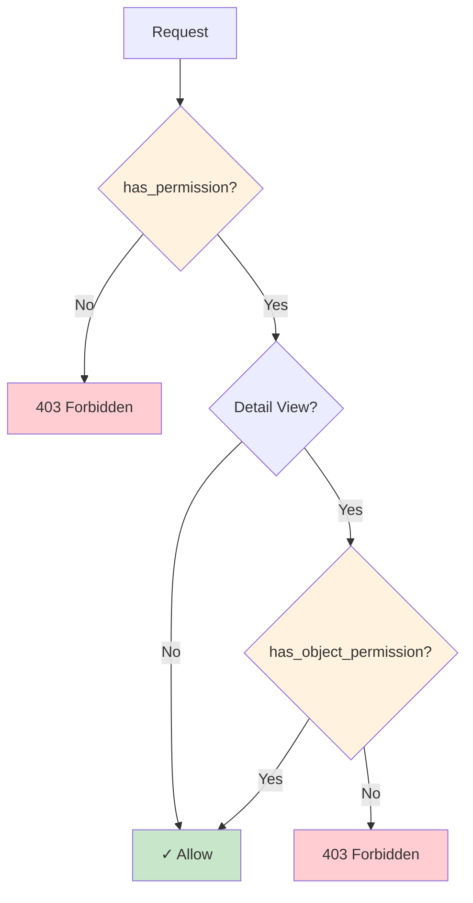
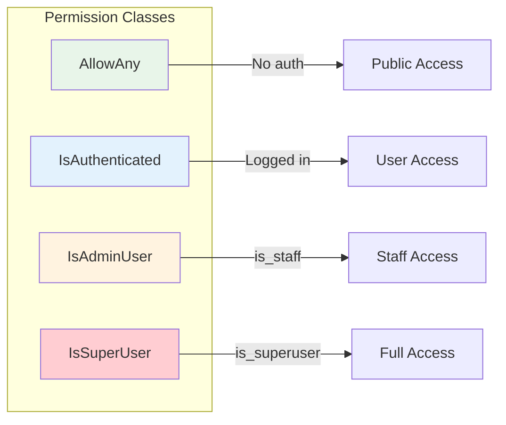

# Permissions

Access control for ViewSets and actions.

## Permission Check Flow



## Permission Hierarchy



## Built-in Permissions

| Class | Description |
|-------|-------------|
| `AllowAny` | No authentication required |
| `IsAuthenticated` | User must be logged in |
| `IsAdminUser` | User must have `is_staff=True` |
| `IsSuperUser` | User must have `is_superuser=True` |

## Usage in ViewSets

### Default Permission

```python
from core import ModelViewSet
from core.permissions import IsAuthenticated

class PostViewSet(ModelViewSet):
    model = Post
    permission_classes = [IsAuthenticated]
```

### Per-Action Permissions

```python
from core.permissions import AllowAny, IsAuthenticated, IsAdminUser

class PostViewSet(ModelViewSet):
    model = Post
    
    permission_classes_by_action = {
        "list": [AllowAny],
        "retrieve": [AllowAny],
        "create": [IsAuthenticated],
        "update": [IsAuthenticated],
        "destroy": [IsAdminUser],
    }
```

### Action Decorator

```python
from core import action
from core.permissions import IsAdminUser

class PostViewSet(ModelViewSet):
    model = Post
    
    @action(detail=True, methods=["POST"], permission_classes=[IsAdminUser])
    async def publish(self, request, db, id: int):
        ...
```

## Custom Permissions

### Basic Permission

```python
from core.permissions import Permission

class IsOwner(Permission):
    """Only allow owners to access."""
    
    async def has_permission(self, request, view) -> bool:
        return request.user is not None
    
    async def has_object_permission(self, request, view, obj) -> bool:
        return obj.author_id == request.user.id
```

### Usage

```python
class PostViewSet(ModelViewSet):
    model = Post
    permission_classes = [IsAuthenticated, IsOwner]
```

## Role-Based Permissions

### HasRole

```python
from core.permissions import HasRole

class PostViewSet(ModelViewSet):
    model = Post
    permission_classes = [HasRole("editor")]
```

### Multiple Roles

```python
class PostViewSet(ModelViewSet):
    model = Post
    permission_classes = [HasRole("editor", "admin")]  # OR logic
```

## Group-Based Permissions

```python
from core.permissions import Permission

class InGroup(Permission):
    def __init__(self, *groups):
        self.groups = groups
    
    async def has_permission(self, request, view) -> bool:
        if not request.user:
            return False
        user_groups = {g.name for g in request.user.groups}
        return bool(user_groups & set(self.groups))

# Usage
class PostViewSet(ModelViewSet):
    permission_classes = [InGroup("editors", "moderators")]
```

## Combining Permissions

Permissions are combined with AND logic:

```python
# User must be authenticated AND owner
permission_classes = [IsAuthenticated, IsOwner]
```

For OR logic, create a custom permission:

```python
class IsOwnerOrAdmin(Permission):
    async def has_object_permission(self, request, view, obj) -> bool:
        if request.user.is_staff:
            return True
        return obj.author_id == request.user.id
```

## Model-Level Permissions

```python
class HasModelPermission(Permission):
    def __init__(self, permission: str):
        self.permission = permission
    
    async def has_permission(self, request, view) -> bool:
        if not request.user:
            return False
        return await request.user.has_perm(self.permission)

# Usage
class PostViewSet(ModelViewSet):
    model = Post
    
    permission_classes_by_action = {
        "create": [HasModelPermission("posts.add")],
        "update": [HasModelPermission("posts.change")],
        "destroy": [HasModelPermission("posts.delete")],
    }
```

## Permission Check Flow

1. `has_permission()` — Called for all requests
2. `has_object_permission()` — Called for detail views (retrieve, update, destroy)

```python
class IsOwner(Permission):
    async def has_permission(self, request, view) -> bool:
        # Called first, for all actions
        return request.user is not None
    
    async def has_object_permission(self, request, view, obj) -> bool:
        # Called second, only for detail actions
        return obj.author_id == request.user.id
```

## Permission Denied Response

```json
{
  "detail": "Permission denied",
  "code": "permission_denied"
}
```

Status: 403 Forbidden

## Collect Permissions

List all permissions in the system:

```bash
core collectpermissions
```

## Examples

### Public Read, Auth Write

```python
class PostViewSet(ModelViewSet):
    model = Post
    
    permission_classes_by_action = {
        "list": [AllowAny],
        "retrieve": [AllowAny],
        "create": [IsAuthenticated],
        "update": [IsAuthenticated],
        "destroy": [IsAuthenticated],
    }
```

### Owner Only

```python
class IsOwner(Permission):
    async def has_object_permission(self, request, view, obj) -> bool:
        return obj.user_id == request.user.id

class ProfileViewSet(ModelViewSet):
    model = Profile
    permission_classes = [IsAuthenticated, IsOwner]
```

### Admin or Owner

```python
class IsAdminOrOwner(Permission):
    async def has_object_permission(self, request, view, obj) -> bool:
        if request.user.is_staff:
            return True
        return obj.author_id == request.user.id

class PostViewSet(ModelViewSet):
    model = Post
    permission_classes = [IsAuthenticated, IsAdminOrOwner]
```

## Next

- [Fields](10-fields.md) — Field types
- [ViewSets](04-viewsets.md) — CRUD endpoints
