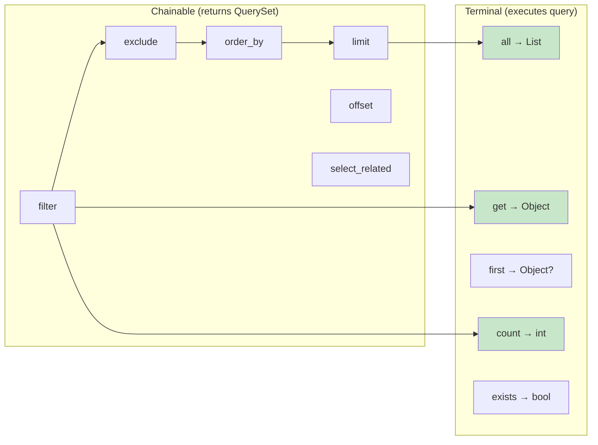
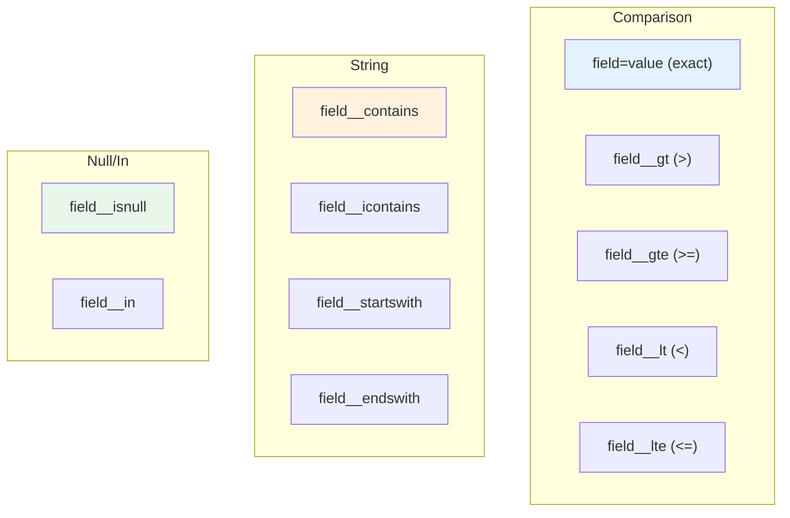

# QuerySets

Django-style query API.

## Query Chain



## Lookup Expressions



## Basic Usage

```python
# All records
items = await Item.objects.using(db).all()

# Filter
items = await Item.objects.using(db).filter(status="active").all()

# Get single record
item = await Item.objects.using(db).get(id=1)

# First/Last
item = await Item.objects.using(db).first()
item = await Item.objects.using(db).order_by("-created_at").last()
```

## Chainable Methods

### `filter(**kwargs)`

```python
# Exact match
await Item.objects.using(db).filter(name="Test").all()

# Multiple conditions (AND)
await Item.objects.using(db).filter(status="active", price__lt=100).all()
```

### `exclude(**kwargs)`

```python
# Exclude records
await Item.objects.using(db).exclude(status="deleted").all()
```

### `order_by(*fields)`

```python
# Ascending
await Item.objects.using(db).order_by("name").all()

# Descending (prefix with -)
await Item.objects.using(db).order_by("-created_at").all()

# Multiple fields
await Item.objects.using(db).order_by("-priority", "name").all()
```

### `limit(n)` / `offset(n)`

```python
# Pagination
await Item.objects.using(db).order_by("id").offset(20).limit(10).all()
```

### `select_related(*fields)`

Eager load relationships.

```python
# Load author with post
posts = await Post.objects.using(db).select_related("author").all()

# Multiple relations
posts = await Post.objects.using(db).select_related("author", "category").all()
```

### `using(session)`

Set database session.

```python
items = await Item.objects.using(db).all()
```

## Terminal Methods

### `all()`

Returns all matching records.

```python
items = await Item.objects.using(db).filter(active=True).all()
```

### `get(**kwargs)`

Returns exactly one record. Raises `DoesNotExist` or `MultipleObjectsReturned`.

```python
item = await Item.objects.using(db).get(id=1)
item = await Item.objects.using(db).filter(status="active").get(slug="test")
```

### `get_or_none(**kwargs)`

Returns one record or `None`.

```python
item = await Item.objects.using(db).get_or_none(id=1)
```

### `first()` / `last()`

```python
item = await Item.objects.using(db).order_by("created_at").first()
item = await Item.objects.using(db).order_by("created_at").last()
```

### `count()`

```python
total = await Item.objects.using(db).filter(active=True).count()
```

### `exists()`

```python
has_items = await Item.objects.using(db).filter(status="pending").exists()
```

### `values(*fields)`

Returns list of dictionaries.

```python
data = await Item.objects.using(db).values("id", "name").all()
# [{"id": 1, "name": "Item 1"}, {"id": 2, "name": "Item 2"}]
```

### `values_list(*fields, flat=False)`

Returns list of tuples or flat list.

```python
data = await Item.objects.using(db).values_list("id", "name")
# [(1, "Item 1"), (2, "Item 2")]

ids = await Item.objects.using(db).values_list("id", flat=True)
# [1, 2, 3]
```

### `delete()`

Deletes matching records.

```python
count = await Item.objects.using(db).filter(status="deleted").delete()
```

### `update(**kwargs)`

Updates matching records.

```python
count = await Item.objects.using(db).filter(status="draft").update(status="published")
```

## Lookup Expressions

Use `field__lookup=value` syntax.

| Lookup | SQL | Example |
|--------|-----|---------|
| `exact` | `= value` | `filter(name="John")` |
| `iexact` | `ILIKE value` | `filter(name__iexact="john")` |
| `contains` | `LIKE '%value%'` | `filter(name__contains="oh")` |
| `icontains` | `ILIKE '%value%'` | `filter(name__icontains="oh")` |
| `startswith` | `LIKE 'value%'` | `filter(name__startswith="Jo")` |
| `istartswith` | `ILIKE 'value%'` | `filter(name__istartswith="jo")` |
| `endswith` | `LIKE '%value'` | `filter(email__endswith=".com")` |
| `iendswith` | `ILIKE '%value'` | `filter(email__iendswith=".COM")` |
| `gt` | `> value` | `filter(price__gt=100)` |
| `gte` | `>= value` | `filter(price__gte=100)` |
| `lt` | `< value` | `filter(price__lt=50)` |
| `lte` | `<= value` | `filter(stock__lte=0)` |
| `in` | `IN (values)` | `filter(status__in=["a", "b"])` |
| `isnull` | `IS NULL` | `filter(deleted_at__isnull=True)` |
| `range` | `BETWEEN a AND b` | `filter(price__range=(10, 100))` |

## Aggregations

```python
from core.querysets import Count, Sum, Avg, Max, Min

result = await Item.objects.using(db).aggregate(
    total=Count("id"),
    avg_price=Avg("price"),
    max_price=Max("price"),
    min_price=Min("price"),
    total_value=Sum("price"),
)
# {"total": 100, "avg_price": 50.0, "max_price": 200, ...}
```

## Soft Delete QuerySet

For models with `SoftDeleteMixin`:

```python
# Default: excludes deleted
items = await Item.objects.using(db).all()

# Include deleted
items = await Item.objects.using(db).with_deleted().all()

# Only deleted
items = await Item.objects.using(db).only_deleted().all()

# Explicitly active only
items = await Item.objects.using(db).active().all()
```

## Tenant QuerySet

For models with `TenantMixin`:

```python
# Filter by tenant
items = await Item.objects.using(db).for_tenant(tenant_id=1).all()

# Uses context tenant if not specified
items = await Item.objects.using(db).for_tenant().all()
```

## Combined QuerySet

For models with both mixins:

```python
# Tenant + soft delete
items = await Item.objects.using(db).for_tenant(1).with_deleted().all()
```

## Raw SQL

When needed:

```python
from sqlalchemy import text

async with db.execute(text("SELECT * FROM items WHERE price > :price"), {"price": 100}) as result:
    rows = result.fetchall()
```

## Examples

### Pagination

```python
page = 1
page_size = 20
offset = (page - 1) * page_size

items = await Item.objects.using(db).order_by("-created_at").offset(offset).limit(page_size).all()
total = await Item.objects.using(db).count()
```

### Search

```python
items = await Item.objects.using(db).filter(
    name__icontains=query
).order_by("name").all()
```

### Complex Filter

```python
items = await Item.objects.using(db).filter(
    status="active",
    price__gte=10,
    price__lte=100,
    category_id__in=[1, 2, 3],
).exclude(
    is_featured=False
).order_by("-created_at").limit(50).all()
```

### Bulk Operations

```python
# Bulk update
count = await Item.objects.using(db).filter(
    status="draft",
    created_at__lt=cutoff_date
).update(status="archived")

# Bulk delete
count = await Item.objects.using(db).filter(
    status="deleted",
    deleted_at__lt=cutoff_date
).delete()
```

## Next

- [Serializers](13-serializers.md) — Input/Output schemas
- [Soft Delete](22-soft-delete.md) — Logical deletion
