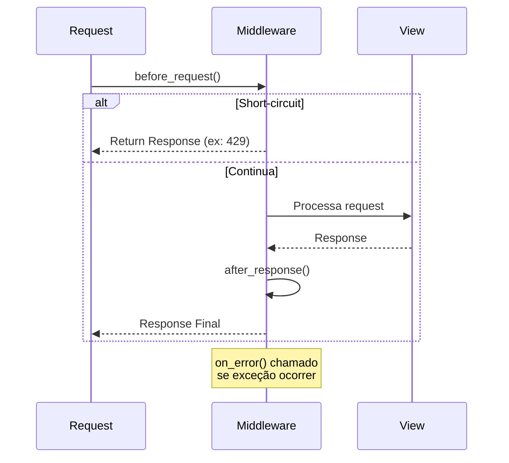

# Middleware

Hooks de processamento request/response com configuração via Settings.

## Stack de Middleware

```mermaid
flowchart TB
    subgraph "Fluxo de Request"
        REQ[Request] --> M1
        
        subgraph Stack["Middleware Stack (ordem importa)"]
            M1[1. TimingMiddleware<br/>order=10]
            M2[2. RequestIDMiddleware<br/>order=5]
            M3[3. AuthMiddleware<br/>order=100]
            M4[4. LoggingMiddleware<br/>order=20]
        end
        
        M1 --> M2 --> M3 --> M4
        M4 --> VIEW[View Handler]
        VIEW --> M4R[4. after_response]
        M4R --> M3R[3. after_response]
        M3R --> M2R[2. after_response]
        M2R --> M1R[1. after_response]
        M1R --> RESP[Response]
    end
    
    style M1 fill:#e3f2fd
    style M2 fill:#e3f2fd
    style M3 fill:#fff3e0
    style M4 fill:#e3f2fd
    style VIEW fill:#c8e6c9
```



## Ciclo de Vida do Middleware



## Configuração via Settings

**Importante:** Registre middleware via settings, não diretamente no FastAPI.

```python
# src/settings.py
class AppSettings(Settings):
    middleware: list[str] = [
        "timing",
        "request_id",
        "auth",
        "myapp.middleware.CustomMiddleware",
    ]
```

Ou via CoreApp:

```python
app = CoreApp(
    middleware=[
        "timing",
        "auth",
        ("logging", {"log_body": True}),  # Com kwargs
    ]
)
```

## Middlewares Built-in

| Shortcut | Classe | Descrição |
|----------|--------|-----------|
| `"timing"` | `TimingMiddleware` | Adiciona header `X-Response-Time` |
| `"request_id"` | `RequestIDMiddleware` | Adiciona ID único de request |
| `"logging"` | `LoggingMiddleware` | Log de requests/responses |
| `"auth"` | `AuthenticationMiddleware` | Autenticação JWT (obrigatória) |
| `"optional_auth"` | `OptionalAuthenticationMiddleware` | Auth JWT opcional |
| `"tenant"` | `TenantMiddleware` | Contexto multi-tenant |
| `"security_headers"` | `SecurityHeadersMiddleware` | Headers de segurança (CSP, HSTS via Settings) |
| `"rate_limit"` | `RateLimitMiddleware` | Rate limit por IP (429; configurável via Settings) |
| `"content_length_limit"` | `ContentLengthLimitMiddleware` | Rejeita body > max_request_size (413) |
| `"maintenance"` | `MaintenanceModeMiddleware` | Modo manutenção |
| `"cors"` | `CORSMiddleware` | Tratamento CORS |
| `"gzip"` | `GZipMiddleware` | Compressão de response |

## Diferença entre `auth` e `optional_auth`

| Middleware | Comportamento |
|------------|---------------|
| `auth` | Requer autenticação, retorna 401 se não autenticado |
| `optional_auth` | Carrega usuário se token presente, permite anônimo |

## Ordem de Execução

Middleware executa na ordem da lista:

```
Request:
  timing.before_request()      # Primeiro (mais externo)
    → auth.before_request()
      → logging.before_request()  # Último (mais interno)
        → [VIEW]
      ← logging.after_response()
    ← auth.after_response()
  ← timing.after_response()
Response
```

## Middleware Customizado

### ASGIMiddleware (Recomendado)

```python
# src/middleware.py
from core.middleware import ASGIMiddleware
from starlette.requests import Request
from starlette.responses import Response
from starlette.types import Scope

class RateLimitMiddleware(ASGIMiddleware):
    name = "RateLimitMiddleware"
    order = 5  # Menor = executa primeiro
    
    # Opcional: filtro de paths
    exclude_paths = ["/health", "/docs"]
    include_paths = []  # Vazio = todos os paths
    
    def __init__(self, app, requests_per_minute: int = 60):
        super().__init__(app)
        self.limit = requests_per_minute
    
    async def before_request(
        self, scope: Scope, request: Request
    ) -> Response | None:
        """Chamado antes do request. Retorne Response para short-circuit."""
        client_ip = request.client.host
        
        if await self.is_rate_limited(client_ip):
            return Response(
                content='{"detail": "Too many requests"}',
                status_code=429,
                media_type="application/json"
            )
        
        # Continua para próximo middleware
        return None
    
    async def after_response(
        self,
        scope: Scope,
        request: Request,
        status_code: int,
        response_headers: list[tuple[bytes, bytes]],
    ) -> None:
        """Chamado após response. Pode modificar headers in-place."""
        response_headers.append((b"x-rate-limit", b"60"))
    
    async def on_error(
        self, scope: Scope, request: Request, exc: Exception
    ) -> Response | None:
        """Chamado em exceção. Retorne Response ou None para re-raise."""
        return None
```

### Registrar Middleware Customizado

```python
# src/settings.py
class AppSettings(Settings):
    middleware: list[str] = [
        "timing",
        ("src.middleware.RateLimitMiddleware", {"requests_per_minute": 100}),
        "auth",
    ]
```

Ou programaticamente:

```python
from core.middleware import register_middleware

register_middleware(
    "src.middleware.RateLimitMiddleware",
    kwargs={"requests_per_minute": 100}
)
```

## Opções dos Middlewares

### TimingMiddleware

```python
middleware = [
    "timing",  # Adiciona header X-Response-Time
]
```

### RequestIDMiddleware

```python
middleware = [
    ("request_id", {"header_name": "X-Request-ID"}),
]
```

### LoggingMiddleware

```python
middleware = [
    ("logging", {
        "log_body": False,
        "log_headers": False,
        "logger_name": "core.requests",
    }),
]
```

### SecurityHeadersMiddleware

```python
middleware = [
    ("security_headers", {
        "headers": {
            "X-Content-Type-Options": "nosniff",
            "X-Frame-Options": "DENY",
            "X-XSS-Protection": "1; mode=block",
        },
        "enable_hsts": True,
        "hsts_max_age": 31536000,
    }),
]
```

### MaintenanceModeMiddleware

```python
middleware = [
    ("maintenance", {
        "maintenance_enabled": False,
        "message": "Sistema em manutenção",
        "allowed_ips": ["127.0.0.1"],
        "allowed_paths": ["/health"],
    }),
]
```

## Request State

Acesse dados definidos pelo middleware:

```python
# Na view
async def my_view(request: Request):
    request_id = request.state.request_id
    user = request.state.user
    tenant_id = request.state.tenant_id
```

## Tratamento de Exceções

```python
class ErrorHandlerMiddleware(ASGIMiddleware):
    name = "ErrorHandlerMiddleware"
    order = 1  # Executa primeiro
    
    async def on_error(
        self, scope: Scope, request: Request, exc: Exception
    ) -> Response | None:
        if isinstance(exc, MyCustomError):
            return JSONResponse(
                {"detail": str(exc)},
                status_code=400
            )
        # Re-raise outras exceções
        return None
```

## Registry de Middleware

```python
from core.middleware import (
    register_middleware,
    unregister_middleware,
    get_registered_middlewares,
    clear_middleware_registry,
    configure_middleware,
)

# Registrar
register_middleware("myapp.middleware.Custom")

# Desregistrar
unregister_middleware("myapp.middleware.Custom")

# Obter todos
middlewares = get_registered_middlewares()

# Limpar todos
clear_middleware_registry()

# Configurar lista inteira
configure_middleware([
    "timing",
    "auth",
    "logging",
], clear_existing=True)
```

## Atributo Order

Controle a ordem de execução via atributo `order`:

```python
class EarlyMiddleware(ASGIMiddleware):
    order = 1  # Executa primeiro

class LateMiddleware(ASGIMiddleware):
    order = 100  # Executa depois
```

Ordens padrão:
- `MaintenanceModeMiddleware`: 1
- `RequestIDMiddleware`: 5
- `TimingMiddleware`: 10
- `SecurityHeadersMiddleware`: 15
- `LoggingMiddleware`: 20
- Default: 100

## Exemplo Completo

```python
# src/settings.py
class AppSettings(Settings):
    middleware: list[str] = [
        "timing",           # Mede tempo de resposta
        "request_id",       # Adiciona ID único
        "security_headers", # Headers de segurança
        "auth",             # Autenticação JWT
        "logging",          # Log de requests
        ("src.middleware.RateLimitMiddleware", {"requests_per_minute": 100}),
    ]
```

## Próximos Passos

- [Security](36-security.md) — Boas práticas de segurança
- [Auth](05-auth.md) — Autenticação
- [Settings](02-settings.md) — Todas as configurações
