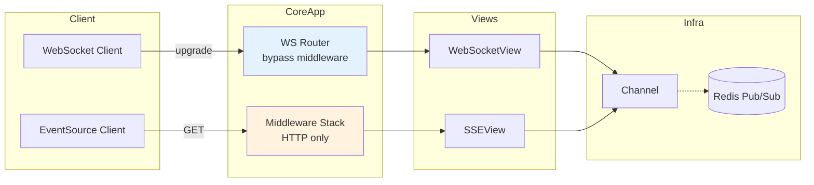
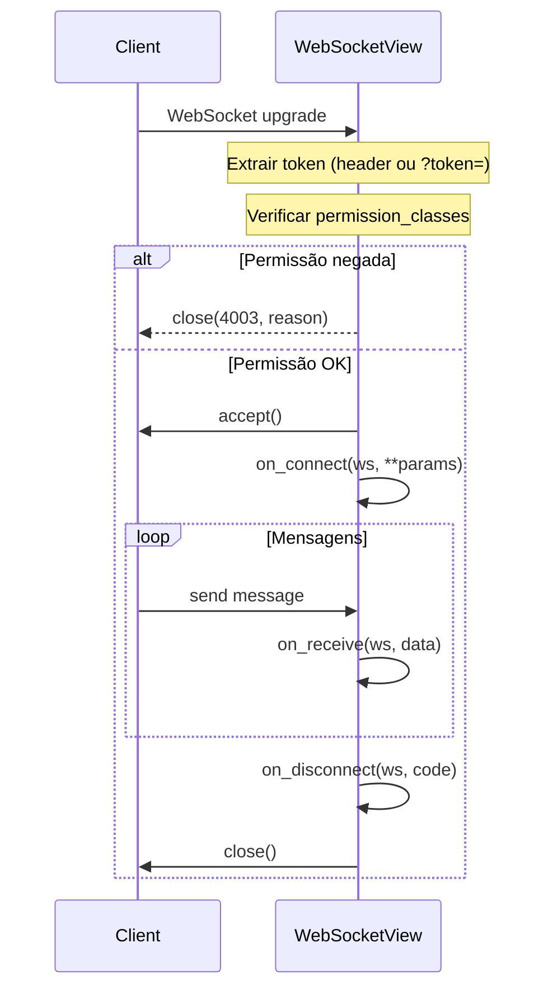
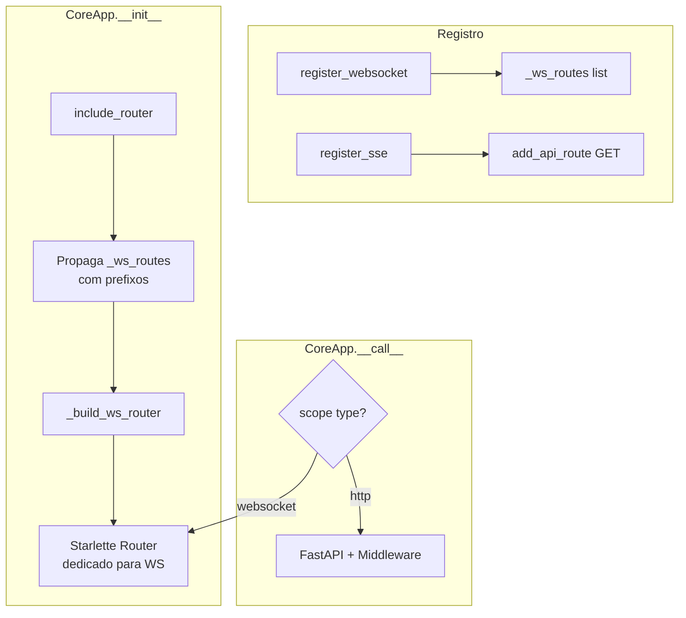

# Real-time: WebSocket, SSE & Channels

Primitivas para comunicação em tempo real com suporte a permissões, autenticação JWT e integração nativa com o sistema de routing.

## Arquitetura



> **WebSocket** connections bypass o middleware stack HTTP automaticamente (o `CoreApp.__call__` roteia `scope["type"] == "websocket"` para um Router Starlette dedicado).  **SSE** é HTTP normal e passa pelo middleware stack completo.

---

## Imports

```python
from core import WebSocketView, SSEView, Channel, sse_response
from core import IsAuthenticated, AllowAny, HasRole  # permissões
```

---

## WebSocketView

Classe base para endpoints WebSocket.  Cada conexão cria uma nova instância (stateful).

### Exemplo público (sem auth)

```python
from core import WebSocketView, Router

class EchoWS(WebSocketView):
    encoding = "json"
    keepalive = 30

    async def on_connect(self, ws, **params):
        self.room = params.get("room", "default")

    async def on_receive(self, ws, data):
        await ws.send_json({"echo": data})

    async def on_disconnect(self, ws, code):
        pass

router = Router(prefix="/chat", tags=["Chat"])
router.register_websocket("/ws/{room}", EchoWS)
```

### Exemplo protegido (com auth)

```python
from core import WebSocketView, IsAuthenticated

class PrivateStream(WebSocketView):
    permission_classes = [IsAuthenticated]

    async def on_connect(self, ws, **params):
        # self.user é preenchido automaticamente após autenticação
        print(f"User {self.user.id} connected")

    async def on_receive(self, ws, data):
        await ws.send_json({"user": self.user.email, "msg": data})
```

### Atributos de classe

| Atributo | Tipo | Default | Descrição |
|----------|------|---------|-----------|
| `permission_classes` | `list[type[Permission]]` | `[]` | Permissões verificadas antes do `accept()`. Se vazio, endpoint é público. |
| `encoding` | `str` | `"json"` | Formato de mensagens: `"json"`, `"text"` ou `"bytes"` |
| `subprotocol` | `str \| None` | `None` | Subprotocolo WebSocket a negociar |
| `keepalive` | `int` | `30` | Segundos entre pings do servidor. `0` = desabilitado |

### Atributos de instância (disponíveis nos hooks)

| Atributo | Tipo | Descrição |
|----------|------|-----------|
| `self.user` | `User \| None` | Usuário autenticado (preenchido após auth, antes de `on_connect`) |

### Lifecycle hooks



### Autenticação WebSocket

O token JWT é extraído automaticamente nesta ordem:

1. **Header** `Authorization: Bearer <token>` — padrão HTTP
2. **Query param** `?token=<token>` — para clientes browser que não suportam headers customizados em WebSocket

```javascript
// JavaScript — via query param (recomendado para browser)
const ws = new WebSocket(`wss://api.example.com/ws/room?token=${jwt}`)

// JavaScript — via header (requer biblioteca como ws em Node.js)
const ws = new WebSocket('wss://api.example.com/ws/room', {
    headers: { Authorization: `Bearer ${jwt}` }
})
```

### Push-only pattern (servidor envia, cliente só escuta)

Para streams unidirecionais (ex: ticks de mercado), sobrescreva `_handle`:

```python
from starlette.websockets import WebSocketState

class TickStream(WebSocketView):
    keepalive = 15

    async def on_connect(self, ws, **params):
        self.symbol = params.get("symbol", "R_100")
        self._queue = await tick_hub.subscribe(self.symbol)

    async def on_disconnect(self, ws, code):
        await tick_hub.unsubscribe(self.symbol, self._queue)

    async def _handle(self, ws):
        params = ws.path_params or {}

        # Auth (se permission_classes definido)
        if self.permission_classes:
            self.user = await _authenticate_ws(ws)
            denied = await _check_ws_permissions(
                self.permission_classes, ws, self.user, self
            )
            if denied:
                await ws.close(code=4003, reason=denied)
                return

        await ws.accept()
        try:
            await self.on_connect(ws, **params)
        except Exception:
            await ws.close(code=1011)
            return

        try:
            while True:
                tick = await self._queue.get()
                if ws.client_state != WebSocketState.CONNECTED:
                    break
                await ws.send_json(tick)
        except Exception:
            pass
        finally:
            await self.on_disconnect(ws, 1000)
```

---

## SSEView

Classe base para endpoints Server-Sent Events (HTTP streaming).

### Exemplo público

```python
from core import SSEView, Router

class SystemEvents(SSEView):
    ping_interval = 15

    async def stream(self, request, **params):
        while True:
            event = await get_next_event()
            yield {"event": "update", "data": event}

router = Router(prefix="/events", tags=["Events"])
router.register_sse("/system", SystemEvents)
```

### Exemplo protegido

```python
from core import SSEView, IsAuthenticated

class UserNotifications(SSEView):
    permission_classes = [IsAuthenticated]

    async def stream(self, request, **params):
        user_id = self.user.id  # disponível após auth
        async for notification in listen_notifications(user_id):
            yield {
                "event": "notification",
                "data": notification,
                "id": str(notification["id"]),
            }
```

### Atributos de classe

| Atributo | Tipo | Default | Descrição |
|----------|------|---------|-----------|
| `permission_classes` | `list[type[Permission]]` | `[]` | Permissões verificadas antes do streaming. Se falhar, emite `event: error`. |
| `ping_interval` | `int` | `15` | Segundos entre comentários `: ping`. `0` = desabilitado |
| `headers` | `dict[str, str]` | `{}` | Headers HTTP extras na response |

### Atributos de instância

| Atributo | Tipo | Descrição |
|----------|------|-----------|
| `self.user` | `User \| None` | Usuário autenticado |

### Formato do evento SSE

O método `stream()` deve fazer `yield` de dicts com as chaves:

| Chave | Tipo | Obrigatório | Descrição |
|-------|------|-------------|-----------|
| `event` | `str` | Não | Nome do evento (ex: `"trade"`, `"log"`) |
| `data` | `str \| dict \| list` | Sim | Payload (dicts são serializados como JSON) |
| `id` | `str` | Não | ID do evento para reconnect via `Last-Event-ID` |
| `retry` | `int` | Não | Tempo em ms para o cliente esperar antes de reconectar |

### Autenticação SSE

O token é extraído automaticamente:

1. **Header** `Authorization: Bearer <token>` — padrão HTTP
2. **Query param** `?token=<token>` — para `EventSource` que não suporta headers

```javascript
// Com header (requer fetch + ReadableStream)
const response = await fetch('/api/events/stream', {
    headers: { Authorization: `Bearer ${token}` }
})
const reader = response.body.getReader()

// Com query param (EventSource nativo)
const es = new EventSource(`/api/events/stream?token=${token}`)
es.addEventListener('trade', (e) => {
    console.log(JSON.parse(e.data))
})
```

---

## Channel

Pub/sub in-process para fan-out de mensagens.  Cada subscriber recebe uma cópia de cada mensagem via `asyncio.Queue`.

### Uso básico

```python
from core import Channel

# Criar canal global
notifications = Channel(maxlen=500)

# Publicar (de qualquer lugar)
await notifications.publish({"type": "alert", "msg": "Server restarting"})

# Consumir (async iterator)
async for msg in notifications.subscribe():
    await ws.send_json(msg)

# Consumir (queue manual)
queue = await notifications.subscribe_queue()
try:
    while True:
        msg = await queue.get()
        process(msg)
finally:
    await notifications.unsubscribe_queue(queue)
```

### API

| Método | Retorno | Descrição |
|--------|---------|-----------|
| `publish(message)` | `int` | Broadcast para todos os subscribers. Retorna quantidade entregue. |
| `subscribe()` | `AsyncIterator` | Async iterator que yield mensagens. Cleanup automático. |
| `subscribe_queue()` | `asyncio.Queue` | Queue raw para consumo manual. |
| `unsubscribe_queue(queue)` | `None` | Remove queue do canal. |
| `subscriber_count` | `int` | Propriedade: número de subscribers ativos. |

### Comportamento com slow consumers

Quando a queue de um subscriber está cheia (`maxlen`), a mensagem mais antiga é descartada para dar lugar à nova.  Se isso falhar, o subscriber é removido automaticamente.

---

## sse_response() — helper funcional

Para endpoints que não precisam de uma classe completa:

```python
from core import sse_response

@router.get("/events")
async def events(request: Request):
    async def gen():
        yield {"event": "hello", "data": "world"}
        yield {"event": "update", "data": {"count": 42}}
    return sse_response(gen())
```

---

## Registro de rotas

### Router

```python
from core import Router

router = Router(prefix="/api/v1", tags=["Realtime"])

# WebSocket
router.register_websocket("/ws/ticks/{symbol}", TickStreamWS)

# SSE
router.register_sse("/events/{userId}", TradeEventsSSE)
```

### AutoRouter

```python
from core import AutoRouter

api = AutoRouter(prefix="/api")
api.register_websocket("/ws/chat/{room}", ChatWS)
api.register_sse("/stream/{userId}", UserStream)
```

### Como funciona internamente



---

## Permissões disponíveis

Todas as permissões do sistema de auth funcionam em WebSocket e SSE:

| Permissão | Descrição |
|-----------|-----------|
| `AllowAny` | Acesso público (default quando `permission_classes = []`) |
| `IsAuthenticated` | Requer token JWT válido |
| `IsAdmin` | Requer `user.is_admin` ou `user.is_superuser` |
| `HasRole("editor")` | Requer role específico |
| `IsOwner` | Verifica propriedade do objeto |

### Permissão customizada

```python
from core.permissions import Permission

class IsSubscriber(Permission):
    message = "Subscription required"

    async def has_permission(self, request, view=None):
        user = getattr(request, "user", None)
        if user is None:
            user = getattr(getattr(request, "state", None), "user", None)
        return user is not None and getattr(user, "is_subscriber", False)

class PremiumStream(WebSocketView):
    permission_classes = [IsAuthenticated, IsSubscriber]

    async def on_connect(self, ws, **params):
        # Só chega aqui se autenticado E subscriber
        ...
```

### Códigos de erro WebSocket

| Código | Significado |
|--------|-------------|
| `4003` | Permissão negada (permission check falhou) |
| `1011` | Erro interno do servidor |
| `1000` | Fechamento normal |

---

## Configuração Nginx para WebSocket

O Nginx precisa de configuração específica para proxy WebSocket:

```nginx
# Dentro do bloco server {}
location /api/ws/ {
    proxy_pass http://upstream_api;
    proxy_http_version 1.1;
    proxy_set_header Upgrade $http_upgrade;
    proxy_set_header Connection "upgrade";
    proxy_set_header Host $host;
    proxy_set_header X-Real-IP $remote_addr;
    proxy_set_header X-Forwarded-For $proxy_add_x_forwarded_for;
    proxy_set_header X-Forwarded-Proto $scheme;
    proxy_read_timeout 86400;
    proxy_send_timeout 86400;
}
```

> O `X-Accel-Buffering: no` é enviado automaticamente pelo SSEView para desabilitar o buffering do Nginx em respostas SSE.

---

## Exemplo completo: sistema de trading

```python
# routes.py
from core import Router, WebSocketView, SSEView, IsAuthenticated, Channel
from starlette.websockets import WebSocket, WebSocketState

# Canal global de ticks
tick_channel = Channel(maxlen=500)

class TickStreamWS(WebSocketView):
    """Ticks de mercado em tempo real (público)."""
    keepalive = 15

    async def on_connect(self, ws, **params):
        self.symbol = params.get("symbol", "R_100")

    async def _handle(self, ws):
        await ws.accept()
        await self.on_connect(ws, **(ws.path_params or {}))
        async for tick in tick_channel.subscribe():
            if tick["symbol"] == self.symbol:
                if ws.client_state != WebSocketState.CONNECTED:
                    break
                await ws.send_json(tick)


class TradeEventsSSE(SSEView):
    """Eventos de trade do usuário (protegido)."""
    permission_classes = [IsAuthenticated]

    async def stream(self, request, **params):
        user_id = self.user.id
        async for event in listen_trade_events(user_id):
            yield {"event": "trade", "data": event}


router = Router(prefix="/trading", tags=["Trading"])
router.register_websocket("/ws/ticks/{symbol}", TickStreamWS)
router.register_sse("/events/{userId}", TradeEventsSSE)
```

```python
# main.py
from core import CoreApp, AutoRouter

api = AutoRouter(prefix="/api")
api.include_router(router)

app = CoreApp(routers=[api])
# WebSocket: /api/trading/ws/ticks/{symbol}
# SSE:       /api/trading/events/{userId}
```
