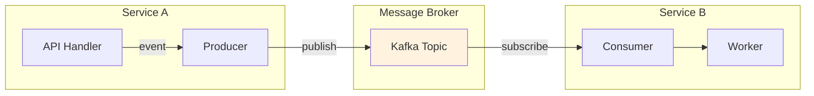
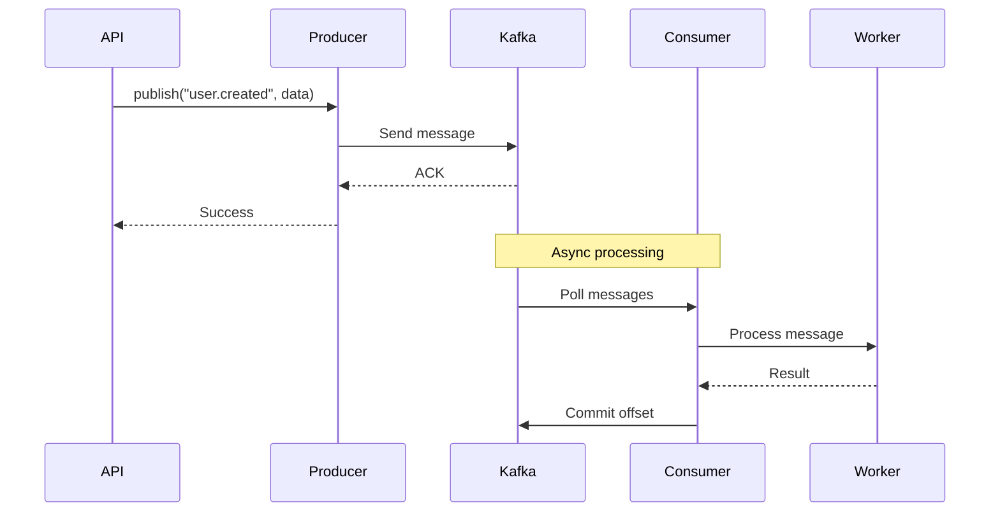

# Messaging

Kafka and Redis integration for event-driven architecture.

## Event Flow



## Producer/Consumer Pattern



## Configuration

### Kafka

```python
# src/settings.py
class AppSettings(Settings):
    kafka_enabled: bool = True
    kafka_backend: str = "aiokafka"  # or "confluent"
    kafka_bootstrap_servers: str = "localhost:9092"
```

Multiple servers:

```bash
KAFKA_BOOTSTRAP_SERVERS=kafka1:9092,kafka2:9092,kafka3:9092
```

### Redis

```python
class AppSettings(Settings):
    redis_url: str = "redis://localhost:6379/0"
```

## Kafka Backends

| Backend | Package | Use Case |
|---------|---------|----------|
| `"aiokafka"` | `aiokafka` | Default, pure async |
| `"confluent"` | `confluent-kafka` | High performance |

```bash
# aiokafka (default)
pip install aiokafka

# confluent (high performance)
pip install confluent-kafka
```

## Producer

### Basic Usage

```python
from core.messaging import get_producer

producer = get_producer("kafka")

# Send message
await producer.send(
    topic="events",
    message={"user_id": 1, "action": "login"},
    key="user-1"
)

# Fire and forget
await producer.send_fire_and_forget(
    topic="logs",
    message={"level": "info", "msg": "User logged in"}
)

# Batch send
await producer.send_batch(
    topic="events",
    messages=[
        {"user_id": 1, "action": "view"},
        {"user_id": 2, "action": "click"},
    ]
)
```

### Decorator

```python
from core.messaging import producer

@producer(topic="user-events")
async def publish_user_event(user_id: int, action: str):
    return {"user_id": user_id, "action": action}

# Usage
await publish_user_event(1, "login")
```

## Consumer

### Decorator

```python
from core.messaging import consumer

@consumer(
    topic="user-events",
    group_id="my-service",
)
async def handle_user_event(message: dict):
    user_id = message["user_id"]
    action = message["action"]
    print(f"User {user_id} performed {action}")
```

### Run Consumer

```bash
core kafka consume user-events --group my-service
```

## Topics

### Define Topics

```python
from core.messaging import Topic, EventTopic, CommandTopic, StateTopic
from pydantic import BaseModel

class UserEventSchema(BaseModel):
    user_id: int
    action: str
    timestamp: str

class UserEvents(EventTopic):
    name = "user-events"
    schema = UserEventSchema
    partitions = 3
    replication_factor = 1
    retention_ms = 604800000  # 7 days
```

### Topic Types

| Type | `cleanup_policy` | Use Case |
|------|------------------|----------|
| `EventTopic` | `"delete"` | Events, logs |
| `CommandTopic` | `"delete"` | Commands, tasks |
| `StateTopic` | `"compact"` | State, snapshots |

## Workers

### Decorator

```python
from core.messaging import worker

@worker(
    topic="tasks",
    output_topic="results",
    group_id="task-processor",
    concurrency=4,
    max_retries=3,
    retry_backoff="exponential",
)
async def process_task(message: dict) -> dict:
    result = await do_work(message)
    return {"status": "completed", "result": result}
```

### Class-Based Worker

```python
from core.messaging import Worker

class TaskWorker(Worker):
    input_topic = "tasks"
    output_topic = "results"
    group_id = "task-processor"
    concurrency = 4
    max_retries = 3
    batch_size = 10
    
    async def process(self, message: dict) -> dict:
        return await do_work(message)
    
    async def process_batch(self, messages: list[dict]) -> list:
        return [await do_work(m) for m in messages]
    
    async def on_error(self, message: dict, error: Exception):
        logger.error(f"Failed: {error}")
    
    async def on_success(self, message: dict, result):
        logger.info(f"Completed: {result}")
```

### Run Worker

```bash
core kafka worker TaskWorker
core kafka worker --all  # Run all workers
```

## Retry Policy

```python
@worker(
    topic="tasks",
    max_retries=5,
    retry_backoff="exponential",  # or "linear", "fixed"
    dlq_topic="tasks-dlq",  # Dead letter queue
)
async def process_task(message: dict):
    ...
```

Backoff calculation:
- `"fixed"`: Always `initial_delay`
- `"linear"`: `initial_delay * attempt`
- `"exponential"`: `initial_delay * (2 ** attempt)`

## Avro Serialization

### Define Schema

```python
from core.messaging import AvroModel

class UserEvent(AvroModel):
    user_id: int
    action: str
    timestamp: str

# Get Avro schema
schema = UserEvent.__avro_schema__()
```

### Send with Avro

```python
from core.messaging.confluent import ConfluentProducer

producer = ConfluentProducer()

event = UserEvent(user_id=1, action="login", timestamp="2024-01-01T00:00:00Z")
await producer.send_avro(
    topic="user-events",
    message=event,
    schema=UserEvent.__avro_schema__()
)
```

### Schema Registry

```python
class AppSettings(Settings):
    kafka_schema_registry_url: str = "http://localhost:8081"
```

## Redis Streams

### Producer

```python
from core.messaging.redis import RedisProducer

producer = RedisProducer()
await producer.send(
    topic="events",  # Stream name
    message={"user_id": 1, "action": "login"}
)
```

### Consumer

```python
from core.messaging.redis import RedisConsumer

consumer = RedisConsumer(
    topics=["events"],
    group_id="my-service"
)

async for message in consumer:
    await process(message)
    await consumer.ack(message)
```

## Kafka Configuration

Full settings:

```python
class AppSettings(Settings):
    # Connection
    kafka_bootstrap_servers: str = "localhost:9092"
    kafka_client_id: str = "core-framework"
    
    # Security
    kafka_security_protocol: str = "PLAINTEXT"  # SSL, SASL_PLAINTEXT, SASL_SSL
    kafka_sasl_mechanism: str | None = None
    kafka_sasl_username: str | None = None
    kafka_sasl_password: str | None = None
    kafka_ssl_cafile: str | None = None
    kafka_ssl_certfile: str | None = None
    kafka_ssl_keyfile: str | None = None
    
    # Producer
    kafka_compression_type: str = "none"  # gzip, snappy, lz4, zstd
    kafka_linger_ms: int = 0
    kafka_max_batch_size: int = 16384
    kafka_request_timeout_ms: int = 30000
    kafka_retry_backoff_ms: int = 100
    
    # Consumer
    kafka_auto_offset_reset: str = "earliest"  # latest, none
    kafka_enable_auto_commit: bool = True
    kafka_auto_commit_interval_ms: int = 5000
    kafka_max_poll_records: int = 500
    kafka_session_timeout_ms: int = 10000
    kafka_heartbeat_interval_ms: int = 3000
```

## CLI Commands

```bash
# List topics
core kafka topics

# Create topic
core kafka create-topic user-events --partitions 3

# Consume messages
core kafka consume user-events --group my-service

# Run worker
core kafka worker MyWorker

# Run all workers
core kafka worker --all
```

## Next

- [Workers](31-workers.md) — Background tasks
- [Settings](02-settings.md) — Configuration
