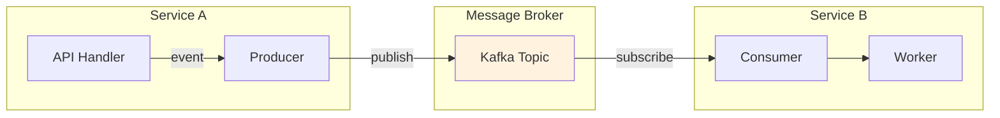

# Messaging

Sistema de mensageria Kafka com configuração plug-and-play. Defina `kafka_enabled=True` no Settings e tudo é configurado automaticamente.

## Arquitetura



## Configuração Plug-and-Play

```python
# src/settings.py
class AppSettings(Settings):
    # Habilita Kafka - auto-configura tudo
    kafka_enabled: bool = True
    kafka_bootstrap_servers: str = "kafka:9092"
    
    # Opcional: Schema Registry para Avro
    kafka_schema_registry_url: str = "http://schema-registry:8081"
    avro_default_namespace: str = "com.mycompany.events"
```

**Zero configuração explícita**: Você NÃO precisa chamar `configure_kafka()`. Basta definir `kafka_enabled=True`.

```python
# Verificar se Kafka foi configurado
from core.config import is_kafka_configured

if is_kafka_configured():
    print("Kafka pronto!")
```

### Múltiplos Brokers (Cluster)

Use vírgula para separar múltiplos servidores Kafka:

```python
class AppSettings(Settings):
    kafka_enabled: bool = True
    # Cluster com 3 brokers
    kafka_bootstrap_servers: str = "kafka1:9092,kafka2:9092,kafka3:9092"
    
    # Schema Registry cluster
    kafka_schema_registry_url: str = "http://sr1:8081,http://sr2:8081"
```

```bash
# .env
KAFKA_BOOTSTRAP_SERVERS=kafka1:9092,kafka2:9092,kafka3:9092
KAFKA_SCHEMA_REGISTRY_URL=http://sr1:8081,http://sr2:8081
```

## Backends

| Backend | Package | Uso |
|---------|---------|-----|
| `"aiokafka"` | `aiokafka` | Default, async puro |
| `"confluent"` | `confluent-kafka` | Alta performance |

```bash
# aiokafka (default)
pip install aiokafka

# confluent (alta performance)
pip install confluent-kafka
```

```python
class AppSettings(Settings):
    kafka_enabled: bool = True
    kafka_backend: str = "confluent"  # ou "aiokafka"
```

## Producer

### Uso Básico

```python
from core.messaging import get_producer

producer = get_producer("kafka")

# Enviar mensagem
await producer.send(
    topic="events",
    message={"user_id": 1, "action": "login"},
    key="user-1"
)

# Fire and forget (mais rápido, menos confiável)
await producer.send_fire_and_forget(
    topic="logs",
    message={"level": "info", "msg": "User logged in"}
)

# Batch send
await producer.send_batch(
    topic="events",
    messages=[
        {"user_id": 1, "action": "view"},
        {"user_id": 2, "action": "click"},
    ]
)
```

### Função publish

```python
from core.messaging import publish

async def publish_user_event(user_id: int, action: str):
    """Publica evento de usuário."""
    await publish("user-events", {"user_id": user_id, "action": action})

# Uso
await publish_user_event(1, "login")

# Ou diretamente (1 linha!)
await publish("user-events", {"user_id": 1, "action": "login"})
```

## Consumer

### Decorator

```python
from core.messaging import consumer

@consumer(
    topic="user-events",
    group_id="my-service",
)
async def handle_user_event(message: dict):
    user_id = message["user_id"]
    action = message["action"]
    print(f"User {user_id} performed {action}")
```

### Executar Consumer

```bash
core kafka consume user-events --group my-service
```

## Topics

### Definir Topics

```python
from core.messaging import Topic, EventTopic, CommandTopic, StateTopic
from pydantic import BaseModel

class UserEventSchema(BaseModel):
    user_id: int
    action: str
    timestamp: str

class UserEvents(EventTopic):
    name = "user-events"
    schema = UserEventSchema
    partitions = 3
    replication_factor = 1
    retention_ms = 604800000  # 7 dias
```

### Tipos de Topic

| Tipo | `cleanup_policy` | Uso |
|------|------------------|-----|
| `EventTopic` | `"delete"` | Eventos, logs |
| `CommandTopic` | `"delete"` | Comandos, tasks |
| `StateTopic` | `"compact"` | Estado, snapshots |

## Workers

### Decorator

```python
from core.messaging import worker

@worker(
    topic="tasks",
    output_topic="results",
    group_id="task-processor",
    concurrency=4,
    max_retries=3,
    retry_backoff="exponential",
)
async def process_task(message: dict) -> dict:
    result = await do_work(message)
    return {"status": "completed", "result": result}
```

### Worker Baseado em Classe

```python
from core.messaging import Worker

class TaskWorker(Worker):
    input_topic = "tasks"
    output_topic = "results"
    group_id = "task-processor"
    concurrency = 4
    max_retries = 3
    batch_size = 10
    
    async def process(self, message: dict) -> dict:
        return await do_work(message)
    
    async def process_batch(self, messages: list[dict]) -> list:
        return [await do_work(m) for m in messages]
    
    async def on_error(self, message: dict, error: Exception):
        logger.error(f"Failed: {error}")
    
    async def on_success(self, message: dict, result):
        logger.info(f"Completed: {result}")
```

### Executar Worker

```bash
core kafka worker TaskWorker
core kafka worker --all  # Todos os workers
```

## Retry Policy

```python
@worker(
    topic="tasks",
    max_retries=5,
    retry_backoff="exponential",  # ou "linear", "fixed"
    dlq_topic="tasks-dlq",  # Dead letter queue
)
async def process_task(message: dict):
    ...
```

Cálculo de backoff:
- `"fixed"`: Sempre `initial_delay`
- `"linear"`: `initial_delay * attempt`
- `"exponential"`: `initial_delay * (2 ** attempt)`

## Avro Serialization

### Namespace Configurável

O namespace Avro é lido automaticamente do Settings:

```python
class AppSettings(Settings):
    kafka_enabled: bool = True
    avro_default_namespace: str = "com.mycompany.events"
```

### Definir Schema

```python
from core.messaging import AvroModel

class UserEvent(AvroModel):
    # Namespace herdado de avro_default_namespace
    # ou defina explicitamente:
    __avro_namespace__ = "com.mycompany.users"
    
    user_id: int
    action: str
    timestamp: str

# Obter schema Avro
schema = UserEvent.__avro_schema__()
```

### Decorator para Schema

```python
from core.messaging import avro_schema

@avro_schema  # Usa avro_default_namespace do Settings
class OrderEvent(AvroModel):
    order_id: int
    status: str

@avro_schema(namespace="com.mycompany.orders")  # Namespace explícito
class OrderCreated(AvroModel):
    order_id: int
    customer_id: int
```

### Enviar com Avro

```python
from core.messaging.confluent import ConfluentProducer

producer = ConfluentProducer()

event = UserEvent(user_id=1, action="login", timestamp="2024-01-01T00:00:00Z")
await producer.send_avro(
    topic="user-events",
    message=event,
    schema=UserEvent.__avro_schema__()
)
```

### Schema Registry

```python
class AppSettings(Settings):
    kafka_enabled: bool = True
    kafka_schema_registry_url: str = "http://localhost:8081"
```

## Redis Streams

### Producer

```python
from core.messaging.redis import RedisProducer

producer = RedisProducer()
await producer.send(
    topic="events",  # Nome do stream
    message={"user_id": 1, "action": "login"}
)
```

### Consumer

```python
from core.messaging.redis import RedisConsumer

consumer = RedisConsumer(
    topics=["events"],
    group_id="my-service"
)

async for message in consumer:
    await process(message)
    await consumer.ack(message)
```

## Referência de Settings

### Conexão

| Setting | Tipo | Default | Descrição |
|---------|------|---------|-----------|
| `kafka_enabled` | `bool` | `False` | **Habilita Kafka** |
| `kafka_backend` | `Literal` | `"aiokafka"` | Backend: aiokafka ou confluent |
| `kafka_bootstrap_servers` | `str` | `"localhost:9092"` | Servidores Kafka |
| `kafka_client_id` | `str` | `"core-framework"` | Client ID |
| `kafka_fire_and_forget` | `bool` | `False` | Não aguardar ACK |

### Segurança

| Setting | Tipo | Default | Descrição |
|---------|------|---------|-----------|
| `kafka_security_protocol` | `Literal` | `"PLAINTEXT"` | PLAINTEXT, SSL, SASL_PLAINTEXT, SASL_SSL |
| `kafka_sasl_mechanism` | `str \| None` | `None` | PLAIN, SCRAM-SHA-256, SCRAM-SHA-512 |
| `kafka_sasl_username` | `str \| None` | `None` | Usuário SASL |
| `kafka_sasl_password` | `str \| None` | `None` | Senha SASL |
| `kafka_ssl_cafile` | `str \| None` | `None` | Certificado CA |
| `kafka_ssl_certfile` | `str \| None` | `None` | Certificado cliente |
| `kafka_ssl_keyfile` | `str \| None` | `None` | Chave privada |

### Producer

| Setting | Tipo | Default | Descrição |
|---------|------|---------|-----------|
| `kafka_compression_type` | `Literal` | `"none"` | none, gzip, snappy, lz4, zstd |
| `kafka_linger_ms` | `int` | `0` | Tempo para acumular batch (ms) |
| `kafka_max_batch_size` | `int` | `16384` | Tamanho máximo do batch (bytes) |
| `kafka_request_timeout_ms` | `int` | `30000` | Timeout de requisição (ms) |
| `kafka_retry_backoff_ms` | `int` | `100` | Backoff entre retries (ms) |

### Consumer

| Setting | Tipo | Default | Descrição |
|---------|------|---------|-----------|
| `kafka_auto_offset_reset` | `Literal` | `"earliest"` | earliest, latest, none |
| `kafka_enable_auto_commit` | `bool` | `True` | Auto-commit de offsets |
| `kafka_auto_commit_interval_ms` | `int` | `5000` | Intervalo de auto-commit (ms) |
| `kafka_max_poll_records` | `int` | `500` | Máximo de registros por poll |
| `kafka_session_timeout_ms` | `int` | `10000` | Timeout de sessão (ms) |
| `kafka_heartbeat_interval_ms` | `int` | `3000` | Intervalo de heartbeat (ms) |

### Avro / Schema Registry

| Setting | Tipo | Default | Descrição |
|---------|------|---------|-----------|
| `kafka_schema_registry_url` | `str \| None` | `None` | URL do Schema Registry |
| `avro_default_namespace` | `str` | `"com.core.events"` | Namespace padrão Avro |

### Messaging Geral

| Setting | Tipo | Default | Descrição |
|---------|------|---------|-----------|
| `messaging_default_topic` | `str` | `"events"` | Tópico padrão |
| `messaging_event_source` | `str` | `""` | Identificador de origem |
| `messaging_dead_letter_topic` | `str` | `"dead-letter"` | Tópico para falhas |

## CLI Commands

```bash
# Listar topics
core kafka topics

# Criar topic
core kafka create-topic user-events --partitions 3

# Consumir mensagens
core kafka consume user-events --group my-service

# Executar worker
core kafka worker MyWorker

# Executar todos os workers
core kafka worker --all
```

## Exemplo Completo

```python
# src/settings.py
class AppSettings(Settings):
    # Kafka auto-configurado
    kafka_enabled: bool = True
    kafka_backend: str = "confluent"
    kafka_bootstrap_servers: str = "kafka:9092"
    kafka_schema_registry_url: str = "http://schema-registry:8081"
    avro_default_namespace: str = "com.mycompany.events"
    
    # Segurança
    kafka_security_protocol: str = "SASL_SSL"
    kafka_sasl_mechanism: str = "SCRAM-SHA-256"
    kafka_sasl_username: str = "my-user"
    kafka_sasl_password: str = "my-password"
    
    # Performance
    kafka_compression_type: str = "lz4"
    kafka_linger_ms: int = 5
    kafka_max_batch_size: int = 32768

# src/events.py
from core.messaging import AvroModel, avro_schema

@avro_schema
class UserCreated(AvroModel):
    user_id: int
    email: str
    created_at: str

# src/handlers.py
from core.messaging import publish, consumer
from datetime import datetime

async def publish_user_created(user_id: int, email: str):
    """Publica evento de usuário criado."""
    await publish("user-events", UserCreated(
        user_id=user_id,
        email=email,
        created_at=datetime.utcnow().isoformat()
    ).model_dump())

@consumer(topic="user-events", group_id="notification-service")
async def send_welcome_email(message: dict):
    await send_email(message["email"], "Welcome!")
```

## Próximos Passos

- [Workers](31-workers.md) — Tasks em background
- [Settings](02-settings.md) — Todas as configurações
