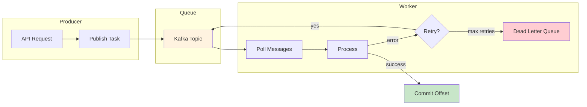
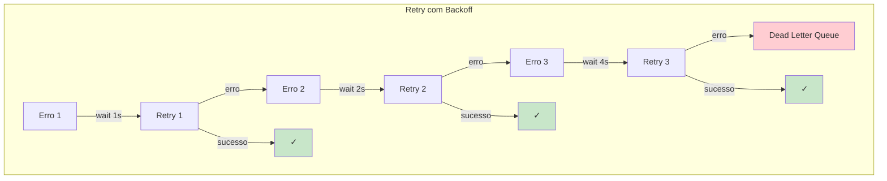

# Workers

Sistema de processamento de tasks em background com configuração plug-and-play.

## Fluxo do Worker



## Estratégia de Retry



## Configuração Plug-and-Play

```python
# src/settings.py
class AppSettings(Settings):
    # Tasks - auto-configurado quando task_enabled=True
    task_enabled: bool = True
    task_default_queue: str = "default"
    task_default_retry: int = 3
    task_default_retry_delay: int = 60
    task_retry_backoff: bool = True
    task_default_timeout: int = 300
    task_worker_concurrency: int = 4
    task_result_backend: str = "redis"  # none, redis, database
    
    # Kafka (necessário para workers)
    kafka_enabled: bool = True
    kafka_bootstrap_servers: str = "localhost:9092"
```

**Zero configuração explícita**: Você NÃO precisa chamar `configure_tasks()`. Basta definir `task_enabled=True`.

## Settings de Tasks

| Setting | Tipo | Default | Descrição |
|---------|------|---------|-----------|
| `task_enabled` | `bool` | `False` | **Habilita Tasks** |
| `task_default_queue` | `str` | `"default"` | Fila padrão |
| `task_default_retry` | `int` | `3` | Número de retries |
| `task_default_retry_delay` | `int` | `60` | Delay entre retries (segundos) |
| `task_retry_backoff` | `bool` | `True` | Usar backoff exponencial |
| `task_default_timeout` | `int` | `300` | Timeout de task (segundos) |
| `task_worker_concurrency` | `int` | `4` | Tarefas concorrentes por worker |
| `task_result_backend` | `Literal` | `"none"` | Backend: none, redis, database |

## Worker com Decorator

```python
from core.messaging import worker

@worker(
    topic="tasks",
    group_id="task-processor",
)
async def process_task(message: dict) -> dict:
    """Processa uma única task."""
    result = await do_work(message["data"])
    return {"status": "completed", "result": result}
```

## Worker Baseado em Classe

```python
from core.messaging import Worker

class EmailWorker(Worker):
    input_topic = "emails"
    group_id = "email-sender"
    concurrency = 4
    max_retries = 3
    
    async def process(self, message: dict) -> dict:
        """Processa uma mensagem."""
        await send_email(
            to=message["to"],
            subject=message["subject"],
            body=message["body"],
        )
        return {"sent": True}
    
    async def on_error(self, message: dict, error: Exception):
        """Chamado em erro de processamento."""
        logger.error(f"Falha ao enviar email: {error}")
    
    async def on_success(self, message: dict, result):
        """Chamado em sucesso."""
        logger.info(f"Email enviado: {result}")
```

## Opções do Worker

```python
class MyWorker(Worker):
    input_topic = "tasks"
    output_topic = "results"      # Opcional: publica resultados
    group_id = "my-worker"
    
    # Concorrência
    concurrency = 4               # Processamento paralelo
    
    # Retry
    max_retries = 3
    retry_backoff = "exponential"  # "linear", "fixed"
    
    # Batching
    batch_size = 10               # Processa N mensagens de uma vez
    batch_timeout = 5.0           # Tempo máximo para batch (segundos)
    
    # Dead Letter Queue
    dlq_topic = "tasks-dlq"       # Mensagens com falha vão aqui
```

## Processamento em Batch

```python
class BatchWorker(Worker):
    input_topic = "events"
    batch_size = 100
    batch_timeout = 10.0
    
    async def process_batch(self, messages: list[dict]) -> list:
        """Processa múltiplas mensagens de uma vez."""
        results = []
        for msg in messages:
            result = await process_single(msg)
            results.append(result)
        return results
```

## Política de Retry

```python
from core.messaging import worker

@worker(
    topic="tasks",
    max_retries=5,
    retry_backoff="exponential",
    dlq_topic="tasks-dlq",
)
async def process_task(message: dict):
    # Se falhar, vai fazer retry com backoff exponencial
    # Após max_retries, mensagem vai para dlq_topic
    ...
```

Cálculo de backoff:
- `"fixed"`: Sempre `initial_delay` segundos
- `"linear"`: `initial_delay * attempt` segundos
- `"exponential"`: `initial_delay * (2 ** attempt)` segundos

## Output Topic

```python
@worker(
    topic="orders",
    output_topic="order-results",
    group_id="order-processor",
)
async def process_order(message: dict) -> dict:
    # Valor de retorno é publicado no output_topic
    return {"order_id": message["id"], "status": "processed"}
```

## Executar Workers

### Worker Único

```bash
core kafka worker EmailWorker
```

### Todos os Workers

```bash
core kafka worker --all
```

### Com Opções

```bash
core kafka worker EmailWorker --concurrency 8
```

## Publicar Tasks

```python
from core.messaging import get_producer

producer = get_producer("kafka")

# Publicar task
await producer.send(
    topic="tasks",
    message={"type": "process", "data": {...}},
    key="task-123"
)
```

## Registry de Workers

```python
from core.messaging import (
    get_worker,
    get_all_workers,
    list_workers,
    run_worker,
    run_all_workers,
)

# Obter config do worker
config = get_worker("EmailWorker")

# Listar todos os workers
names = list_workers()

# Executar programaticamente
await run_worker(EmailWorker)
await run_all_workers()
```

## Tratamento de Erros

```python
class MyWorker(Worker):
    input_topic = "tasks"
    dlq_topic = "tasks-dlq"
    
    async def process(self, message: dict):
        try:
            return await do_work(message)
        except TemporaryError:
            # Re-raise para disparar retry
            raise
        except PermanentError as e:
            # Log e não faz retry
            logger.error(f"Erro permanente: {e}")
            return {"error": str(e)}
    
    async def on_error(self, message: dict, error: Exception):
        # Chamado após todos os retries esgotados
        # Mensagem será enviada para dlq_topic
        await notify_admin(error)
```

## Graceful Shutdown

Workers tratam SIGTERM/SIGINT:

1. Para de aceitar novas mensagens
2. Finaliza processamento do batch atual
3. Commit dos offsets
4. Sai limpo

## Monitoramento

```python
class MyWorker(Worker):
    async def on_success(self, message: dict, result):
        metrics.increment("worker.success")
    
    async def on_error(self, message: dict, error: Exception):
        metrics.increment("worker.error")
```

## Operations Center

O admin panel inclui monitoramento de workers:

```python
class AppSettings(Settings):
    ops_enabled: bool = True
    ops_task_persist: bool = True
    ops_task_retention_days: int = 30
    ops_worker_heartbeat_interval: int = 30
    ops_worker_offline_ttl: int = 24
```

## Exemplo Completo

```python
# src/workers/email.py
from core.messaging import Worker
from src.services.email import EmailService

class EmailWorker(Worker):
    input_topic = "emails"
    group_id = "email-sender"
    concurrency = 4
    max_retries = 3
    retry_backoff = "exponential"
    dlq_topic = "emails-dlq"
    
    def __init__(self):
        self.email_service = EmailService()
    
    async def process(self, message: dict) -> dict:
        await self.email_service.send(
            to=message["to"],
            subject=message["subject"],
            template=message["template"],
            context=message.get("context", {}),
        )
        return {"sent": True, "to": message["to"]}
    
    async def on_error(self, message: dict, error: Exception):
        logger.error(f"Email falhou: {message['to']} - {error}")
    
    async def on_success(self, message: dict, result):
        logger.info(f"Email enviado: {result['to']}")
```

```bash
# Executar worker
core kafka worker EmailWorker
```

## Próximos Passos

- [Messaging](30-messaging.md) — Integração Kafka/Redis
- [Settings](02-settings.md) — Todas as configurações
