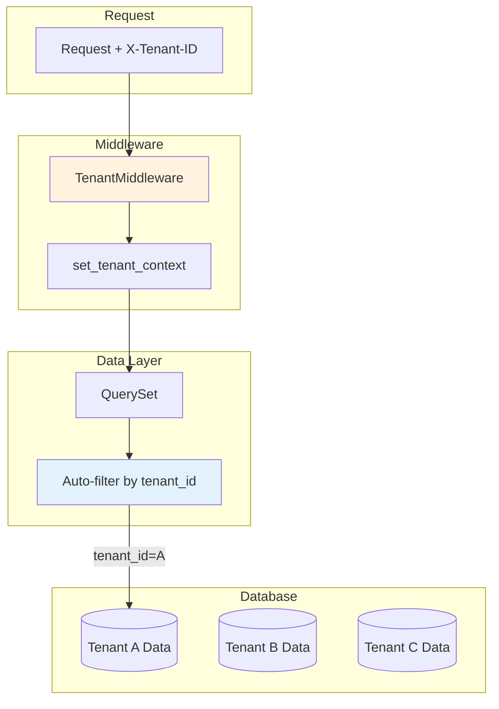
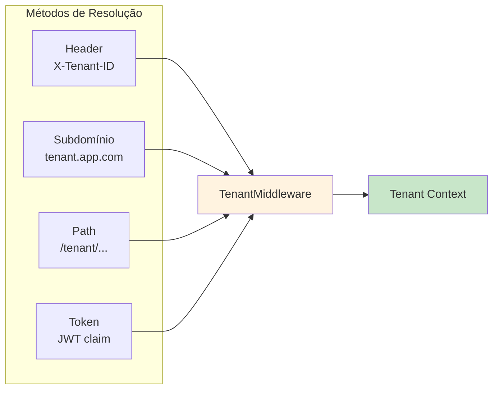

# Multi-Tenancy

Isolamento de dados para aplicações multi-tenant com configuração via Settings.

## Isolamento de Dados



## Resolução de Tenant



## Configuração via Settings

```python
# src/settings.py
class AppSettings(Settings):
    # Habilita multi-tenancy
    tenancy_enabled: bool = True
    
    # Campo FK nos models
    tenancy_field: str = "workspace_id"
    
    # Atributo do usuário com tenant ID
    tenancy_user_attribute: str = "workspace_id"
    
    # Header HTTP para tenant (fallback)
    tenancy_header: str = "X-Tenant-ID"
    
    # Rejeitar requests sem tenant
    tenancy_require: bool = False
```

## Settings de Tenancy

| Setting | Tipo | Default | Descrição |
|---------|------|---------|-----------|
| `tenancy_enabled` | `bool` | `False` | Habilita multi-tenancy automático |
| `tenancy_field` | `str` | `"workspace_id"` | Nome do campo de tenant nos models |
| `tenancy_user_attribute` | `str` | `"workspace_id"` | Atributo do usuário com tenant ID |
| `tenancy_header` | `str` | `"X-Tenant-ID"` | Header HTTP para tenant (fallback) |
| `tenancy_require` | `bool` | `False` | Rejeitar requests sem tenant |

## Model de Tenant

```python
from core import Model, Field
from sqlalchemy.orm import Mapped

class Workspace(Model):
    __tablename__ = "workspaces"
    
    id: Mapped[int] = Field.pk()
    name: Mapped[str] = Field.string(max_length=100)
    slug: Mapped[str] = Field.string(max_length=50, unique=True)
```

## TenantMixin

Adicione aos models que pertencem a um tenant:

```python
from core import Model, Field
from core.tenancy import TenantMixin, TenantManager
from sqlalchemy.orm import Mapped

class Project(Model, TenantMixin):
    __tablename__ = "projects"
    objects = TenantManager["Project"]()
    
    id: Mapped[int] = Field.pk()
    name: Mapped[str] = Field.string(max_length=200)
    # workspace_id é adicionado pelo TenantMixin
```

## Queries

### Filtrar por Tenant

```python
# Tenant explícito
projects = await Project.objects.using(db).for_tenant(workspace_id).all()

# Do contexto (definido pelo middleware)
projects = await Project.objects.using(db).for_tenant().all()
```

### Query Cross-Tenant

```python
# Todos os projetos (uso admin)
all_projects = await Project.objects.using(db).all()
```

## TenantMiddleware

Auto-define contexto de tenant a partir do request:

```python
# src/settings.py
class AppSettings(Settings):
    middleware: list[str] = [
        "tenant",  # ou "tenancy"
        "auth",
    ]
```

O middleware extrai tenant de:
1. Header `X-Tenant-ID`
2. Tenant padrão do usuário
3. Query parameter `?tenant_id=`

## Definir Contexto de Tenant

### No Middleware

```python
from core.tenancy import set_tenant_context

class CustomTenantMiddleware(ASGIMiddleware):
    async def before_request(self, scope, request):
        tenant_id = extract_tenant(request)
        set_tenant_context(tenant_id)
        return None
```

### Na View

```python
from core.tenancy import set_tenant_context

async def my_view(request, db):
    set_tenant_context(request.user.workspace_id)
    
    # Agora for_tenant() usa este contexto
    projects = await Project.objects.using(db).for_tenant().all()
```

## Integração com ViewSet

```python
from core import ModelViewSet
from core.tenancy import TenantMixin

class ProjectViewSet(ModelViewSet):
    model = Project
    
    async def get_queryset(self, db):
        # Auto-filtra por tenant
        return Project.objects.using(db).for_tenant(
            self.request.state.tenant_id
        )
    
    async def perform_create(self, instance, validated_data, db):
        instance.workspace_id = self.request.state.tenant_id
        await instance.save(db)
```

## Tenancy por Subdomínio

```python
class SubdomainTenantMiddleware(ASGIMiddleware):
    async def before_request(self, scope, request):
        host = request.headers.get("host", "")
        subdomain = host.split(".")[0]
        
        workspace = await Workspace.objects.using(db).get_or_none(
            slug=subdomain
        )
        
        if workspace:
            set_tenant_context(workspace.id)
            request.state.workspace = workspace
        
        return None
```

## Tenancy por Path

```python
# Rotas: /workspaces/{workspace_id}/projects/

class ProjectViewSet(ModelViewSet):
    model = Project
    
    async def get_queryset(self, db, workspace_id: int):
        return Project.objects.using(db).for_tenant(workspace_id)
```

## FlexibleTenantMixin

Para models que podem ser tenant-scoped ou globais:

```python
from core.tenancy import FlexibleTenantMixin

class Template(Model, FlexibleTenantMixin):
    __tablename__ = "templates"
    
    id: Mapped[int] = Field.pk()
    name: Mapped[str] = Field.string(max_length=100)
    # workspace_id é nullable
```

```python
# Templates globais (workspace_id = NULL)
global_templates = await Template.objects.using(db).filter(
    workspace_id__isnull=True
).all()

# Templates do tenant
tenant_templates = await Template.objects.using(db).for_tenant(workspace_id).all()

# Ambos
all_templates = await Template.objects.using(db).filter(
    Q(workspace_id__isnull=True) | Q(workspace_id=workspace_id)
).all()
```

## Com Soft Delete

```python
from core.models import TenantSoftDeleteManager

class Project(Model, TenantMixin, SoftDeleteMixin):
    __tablename__ = "projects"
    objects = TenantSoftDeleteManager["Project"]()
```

```python
# Filtra por tenant + exclui deletados
projects = await Project.objects.using(db).for_tenant(workspace_id).all()

# Incluir deletados
projects = await Project.objects.using(db).for_tenant(workspace_id).with_deleted().all()
```

## Campo de Tenant Customizado

```python
class Project(Model, TenantMixin):
    __tablename__ = "projects"
    
    # Sobrescreve nome do campo padrão
    tenant_field = "organization_id"
    
    organization_id: Mapped[int] = Field.foreign_key("organizations.id")
```

## Exemplo Completo

```python
# src/settings.py
class AppSettings(Settings):
    tenancy_enabled: bool = True
    tenancy_field: str = "workspace_id"
    tenancy_user_attribute: str = "workspace_id"
    tenancy_require: bool = True
    
    middleware: list[str] = [
        "timing",
        "tenant",
        "auth",
    ]

# src/apps/workspaces/models.py
from core import Model, Field
from sqlalchemy.orm import Mapped

class Workspace(Model):
    __tablename__ = "workspaces"
    
    id: Mapped[int] = Field.pk()
    name: Mapped[str] = Field.string(max_length=100)
    slug: Mapped[str] = Field.string(max_length=50, unique=True)

# src/apps/projects/models.py
from core import Model, Field
from core.tenancy import TenantMixin, TenantManager
from sqlalchemy.orm import Mapped

class Project(Model, TenantMixin):
    __tablename__ = "projects"
    objects = TenantManager["Project"]()
    
    id: Mapped[int] = Field.pk()
    name: Mapped[str] = Field.string(max_length=200)

# src/apps/projects/views.py
from core import ModelViewSet

class ProjectViewSet(ModelViewSet):
    model = Project
    
    async def get_queryset(self, db):
        return Project.objects.using(db).for_tenant(
            self.request.state.tenant_id
        )
    
    async def perform_create(self, instance, validated_data, db):
        instance.workspace_id = self.request.state.tenant_id
        await instance.save(db)
```

## Próximos Passos

- [Soft Delete](22-soft-delete.md) — Deleção lógica
- [QuerySets](12-querysets.md) — Consultas de dados
- [Settings](02-settings.md) — Todas as configurações
