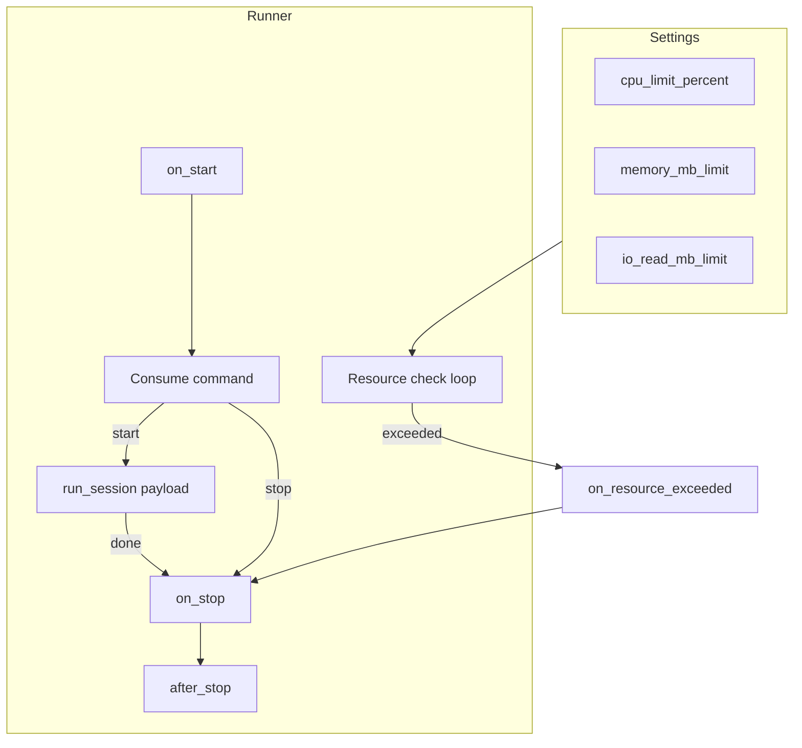

# Runner (sessões longas com limites de recursos)

Recurso plug-and-play para sessões longas: uma classe `Runner`, configuração via Settings, limites de CPU/memória/IO e hooks de lifecycle. Escala com micro-instâncias (Cloud Run, K8s); cada instância executa um runner que consome comandos start/stop via Kafka.

## Conceito

- **Runner = controlador**: o processo que você inicia com `stride runrunner Nome` **só consome Kafka** e cria/encerra **instâncias** (uma por sessão). Cada instância roda em **processo separado** (default), com DB e Redis próprios, sem compartilhar recursos com a API nem com o controlador — evita vazamento de contexto, logs misturados e degradação.
- **Instância isolada** (default `runner_isolated_instances=True`): ao receber `start`, o controlador espawana um processo filho que executa `run_session(payload)`; ao receber `stop`, envia SIGTERM ao processo. O filho tem seu próprio pool de DB (`runner_session_pool_size`) e recursos; a API continua estável.
- **Um runner (controlador) por deploy**: cada instância (pod/container) executa um único processo controlador; ele pode ter várias sessões ativas (vários processos filho).
- **Limites**: CPU %, memória MB, opcionalmente IO leitura (MB). Verificação periódica no controlador; ao exceder (modo legado in-process), dispara shutdown e hook `on_resource_exceeded`.
- **Hooks**: `on_start`, `on_stop`, `after_stop`, `on_resource_exceeded` para o app customizar (persistir estado, emitir evento, fechar conexões).

## Fluxo



## Settings (runner_*)

Em `src/settings.py` (ou via `.env`):

| Variável | Tipo | Default | Descrição |
|----------|------|---------|-----------|
| `runner_enabled` | bool | false | Habilita o sistema de Runner. |
| `runner_cpu_limit_percent` | float | 0 | Limite de CPU em % (0 = desativado). |
| `runner_memory_mb_limit` | float | 0 | Limite de memória em MB (0 = desativado). |
| `runner_io_read_mb_limit` | float | 0 | Limite de IO leitura em MB (0 = desativado). |
| `runner_check_interval_seconds` | float | 5 | Intervalo entre verificações de recursos. |
| `runner_shutdown_grace_seconds` | float | 5 | Tempo máximo para shutdown gracioso. |
| `runner_default_topic` | str | "runner.commands" | Tópico Kafka para comandos start/stop. |
| `runner_isolated_instances` | bool | true | Se true, cada sessão roda em processo filho (DB/Redis isolados; stop via SIGTERM). Se false, sessões rodam in-process (legado). |
| `runner_session_pool_size` | int | 2 | Tamanho do pool de conexões do DB no processo da instância (cada instância = 1 processo). |

Exemplo:

```python
# src/settings.py
class AppSettings(Settings):
    runner_enabled: bool = True
    runner_cpu_limit_percent: float = 80.0
    runner_memory_mb_limit: float = 512.0
    runner_io_read_mb_limit: float = 0.0
    runner_check_interval_seconds: float = 5.0
    runner_shutdown_grace_seconds: float = 10.0
    runner_default_topic: str = "strategy.session.commands"
```

## API da classe base

- **Atributos de configuração** (override em subclasse ou via Settings):  
  `input_topic`, `group_id`, `cpu_limit_percent`, `memory_mb_limit`, `io_read_mb_limit`, `check_interval_seconds`, `shutdown_grace_seconds`.
- **Controle**: `request_stop()`, `is_stop_requested`, `current_session_id`.
- **Hooks** (override no app):
  - `on_start()` — antes de iniciar o loop de consumo.
  - `run_session(payload)` — **obrigatório**; executa a sessão; deve respeitar `_stop_requested`.
  - `on_stop()` — quando parada foi solicitada (stop ou limite).
  - `after_stop()` — após encerramento (cleanup, persistência, eventos).
  - `on_resource_exceeded(metrics)` — quando CPU/memory/IO excedem limite; default: log e `request_stop()`.

Mensagens no tópico:

- `{"action": "start", "session_id": "...", ...}` — inicia sessão com o payload.
- `{"action": "stop", "session_id": "..."}` ou `{"action": "stop"}` — solicita parada.

## Exemplo: RunnerStrategy(Runner)

```python
# src/runners.py
from strider.messaging import Runner

class RunnerStrategy(Runner):
    input_topic = "strategy.session.commands"

    async def on_start(self) -> None:
        # Conectar a DB, Redis, etc.
        pass

    async def run_session(self, payload: dict) -> None:
        session_id = payload.get("session_id")
        if not session_id:
            return
        # Bootstrap: carregar conta, runtime, criar StrategyRobot
        # Registrar listener de stop (Redis/Kafka)
        # Executar robot.run() até self._stop_requested
        while not self._stop_requested:
            await asyncio.sleep(1)
        # Cleanup interno

    async def on_stop(self) -> None:
        # Desregistrar listener, parar market data
        pass

    async def after_stop(self) -> None:
        # Fechar DB, emitir LOG_18 (sessão encerrada)
        pass

    async def on_resource_exceeded(self, metrics: dict) -> None:
        # Log e opcionalmente publicar "session.stopped" com motivo "resource_limit"
        await super().on_resource_exceeded(metrics)
```

## CLI

- Subir um runner:  
  `stride runrunner StrategySessionRunner`  
  (ou o nome da sua classe)
- Listar runners registrados:  
  `stride runners`

O comando `runrunner` faz auto-discovery de módulos (`workers_module`, `runners.py`, `src/runners.py`, etc.), registra as subclasses de `Runner` e executa a classe pelo nome.

## Integração com auto-scale (Cloud Run / K8s)

- Defina **requests/limits** de CPU e memória no deployment; use os mesmos (ou menores) em `runner_cpu_limit_percent` e `runner_memory_mb_limit` para encerrar antes do OOMKill. A instância faz shutdown limpo e pode emitir eventos em `after_stop`.
- **HPA**: escale por CPU/memória ou por fila (ex.: mensagens "start" pendentes). O runner apenas consome da fila e respeita os limites configurados.

## Resumo

- **Framework**: recurso plug-and-play para sessões longas com limites e hooks (`on_start`, `on_stop`, `after_stop`, `on_resource_exceeded`), integrado ao Kafka e ao Settings.
- **App**: implementar uma classe `MyRunner(Runner)`, configurar `runner_*` e rodar com `stride runrunner MyRunner`; controle de recursos e escalabilidade ficam na framework.
