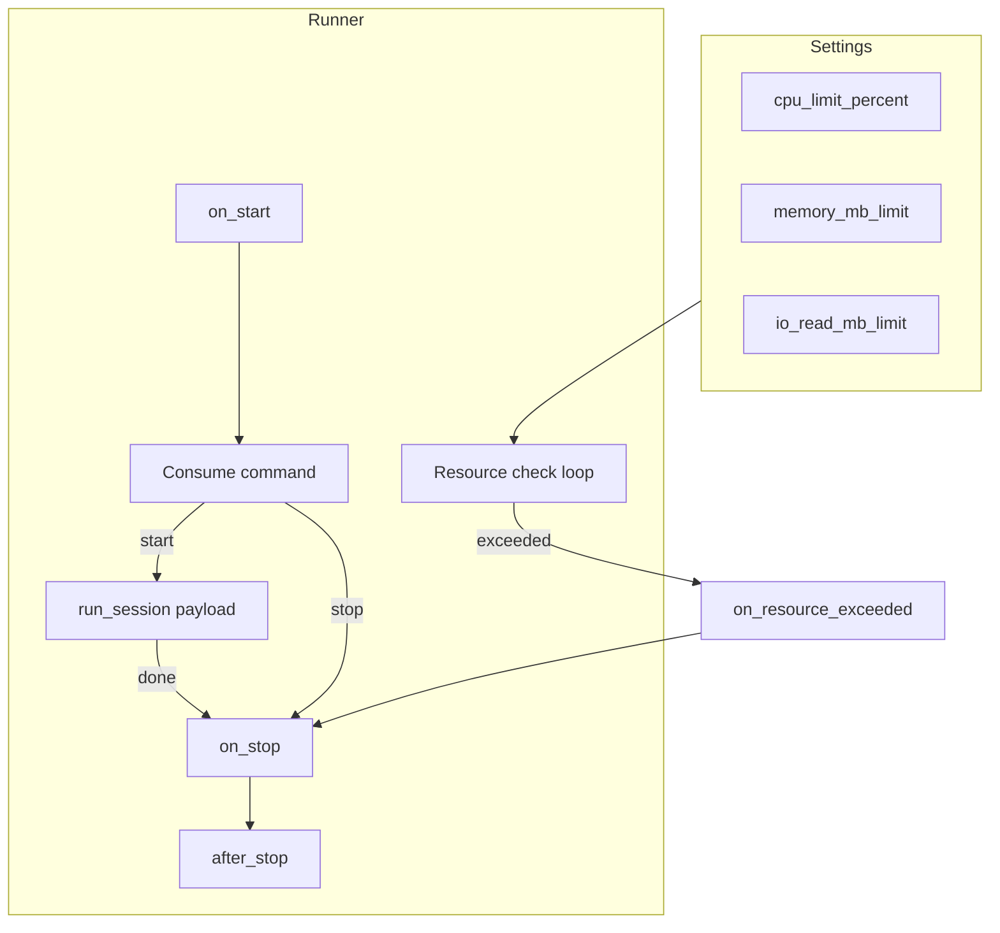

# Runner (sessões longas com limites de recursos)

Recurso plug-and-play para sessões longas: uma classe `Runner`, configuração via Settings, limites de CPU/memória/IO e hooks de lifecycle. Escala com micro-instâncias (Cloud Run, K8s); cada instância executa um runner que consome comandos start/stop via Kafka.

## Conceito

- **Runner = controlador**: o processo que você inicia com `stride runrunner Nome` **só consome Kafka** e cria/encerra **instâncias** (uma por sessão). Cada instância roda em **processo separado** (default), com DB e Redis próprios, sem compartilhar recursos com a API nem com o controlador — evita vazamento de contexto, logs misturados e degradação.
- **Instância isolada** (default `runner_isolated_instances=True`): ao receber `start`, o controlador espawana um processo filho que executa `run_session(payload)`; ao receber `stop`, envia SIGTERM ao processo. O filho tem seu próprio pool de DB (`runner_session_pool_size`) e recursos; a API continua estável.
- **Um runner (controlador) por deploy**: cada instância (pod/container) executa um único processo controlador; ele pode ter várias sessões ativas (vários processos filho).
- **Limites**: CPU %, memória MB, opcionalmente IO leitura (MB). Verificação periódica no controlador; ao exceder (modo legado in-process), dispara shutdown e hook `on_resource_exceeded`.
- **Hooks**: `on_start`, `on_stop`, `after_stop`, `on_resource_exceeded` para o app customizar (persistir estado, emitir evento, fechar conexões).

## Fluxo



## Settings (runner_*)

Em `src/settings.py` (ou via `.env`):

| Variável | Tipo | Default | Descrição |
|----------|------|---------|-----------|
| `runner_enabled` | bool | false | Habilita o sistema de Runner. |
| `runner_cpu_limit_percent` | float | 0 | Limite de CPU em % (0 = desativado). |
| `runner_memory_mb_limit` | float | 0 | Limite de memória em MB (0 = desativado). |
| `runner_io_read_mb_limit` | float | 0 | Limite de IO leitura em MB (0 = desativado). |
| `runner_check_interval_seconds` | float | 5 | Intervalo entre verificações de recursos. |
| `runner_shutdown_grace_seconds` | float | 5 | Tempo máximo para shutdown gracioso. |
| `runner_default_topic` | str | "runner.commands" | Tópico Kafka para comandos start/stop. |
| `runner_isolated_instances` | bool | true | Se true, cada sessão roda em processo filho (DB/Redis isolados; stop via SIGTERM). Se false, sessões rodam in-process (legado). |
| `runner_session_pool_size` | int | 2 | Tamanho do pool de conexões do DB no processo da instância (cada instância = 1 processo). |
| `runner_logs_dir` | str | "" | Diretório para logs dedicados por instância (arquivo JSONL `session_id.log`). Vazio = `STRIDER_RUNNER_LOGS_DIR` ou `/tmp/strider-runner-logs`. |

Exemplo:

```python
# src/settings.py
class AppSettings(Settings):
    runner_enabled: bool = True
    runner_cpu_limit_percent: float = 80.0
    runner_memory_mb_limit: float = 512.0
    runner_io_read_mb_limit: float = 0.0
    runner_check_interval_seconds: float = 5.0
    runner_shutdown_grace_seconds: float = 10.0
    runner_default_topic: str = "strategy.session.commands"
```

## API da classe base

- **Atributos de configuração** (override em subclasse ou via Settings):  
  `input_topic`, `group_id`, `cpu_limit_percent`, `memory_mb_limit`, `io_read_mb_limit`, `check_interval_seconds`, `shutdown_grace_seconds`.
- **Controle**: `request_stop()`, `is_stop_requested`, `current_session_id`.
- **Hooks** (override no app):
  - `on_start()` — antes de iniciar o loop de consumo.
  - `run_session(payload)` — **obrigatório**; executa a sessão; deve respeitar `_stop_requested`.
  - `on_stop()` — quando parada foi solicitada (stop ou limite).
  - `after_stop()` — após encerramento (cleanup, persistência, eventos).
  - `on_resource_exceeded(metrics)` — quando CPU/memory/IO excedem limite; default: log e `request_stop()`.

Mensagens no tópico:

- `{"action": "start", "session_id": "...", ...}` — inicia sessão com o payload.
- `{"action": "stop", "session_id": "..."}` ou `{"action": "stop"}` — solicita parada.

As mensagens são publicadas com **Kafka key = session_id**, de modo que start e stop da mesma sessão vão para a mesma partição e o mesmo consumidor — assim o processo que criou o filho é o que recebe o stop e pode encerrá-lo (SIGTERM). Sem a key, com múltiplas partições/consumidores, o stop poderia ser consumido por outro nó que não tem o processo e o filho ficaria órfão.

## Exemplo: RunnerStrategy(Runner)

```python
# src/runners.py
from strider.messaging import Runner

class RunnerStrategy(Runner):
    input_topic = "strategy.session.commands"

    async def on_start(self) -> None:
        # Conectar a DB, Redis, etc.
        pass

    async def run_session(self, payload: dict) -> None:
        session_id = payload.get("session_id")
        if not session_id:
            return
        # Bootstrap: carregar conta, runtime, criar StrategyRobot
        # Registrar listener de stop (Redis/Kafka)
        # Executar robot.run() até self._stop_requested
        while not self._stop_requested:
            await asyncio.sleep(1)
        # Cleanup interno

    async def on_stop(self) -> None:
        # Desregistrar listener, parar market data
        pass

    async def after_stop(self) -> None:
        # Fechar DB, emitir LOG_18 (sessão encerrada)
        pass

    async def on_resource_exceeded(self, metrics: dict) -> None:
        # Log e opcionalmente publicar "session.stopped" com motivo "resource_limit"
        await super().on_resource_exceeded(metrics)
```

## CLI

- Subir um runner:  
  `stride runrunner StrategySessionRunner`  
  (ou o nome da sua classe)
- Listar runners registrados:  
  `stride runners`

O comando `runrunner` faz auto-discovery de módulos (`workers_module`, `runners.py`, `src/runners.py`, etc.), registra as subclasses de `Runner` e executa a classe pelo nome.

## Integração com auto-scale (Cloud Run / K8s)

- Defina **requests/limits** de CPU e memória no deployment; use os mesmos (ou menores) em `runner_cpu_limit_percent` e `runner_memory_mb_limit` para encerrar antes do OOMKill. A instância faz shutdown limpo e pode emitir eventos em `after_stop`.
- **HPA**: escale por CPU/memória ou por fila (ex.: mensagens "start" pendentes). O runner apenas consome da fila e respeita os limites configurados.

## Banco de dados, Redis e recursos isolados em escala

### Isolamento por processo (modo default)

Com `runner_isolated_instances=True` (default), cada **instância** de sessão roda em um **processo filho**. Esse processo:

- Chama `init_database()` sozinho → **pool de DB próprio** (tamanho `runner_session_pool_size`, ex.: 2). Nenhuma conexão é compartilhada com a API nem com o controlador.
- Pode criar seu próprio cliente **Redis** (novo connection pool no processo). Não reutilize o cliente global da API.
- Tem **logs** e **memória** isolados; stop é via SIGTERM, sem depender de loop reativo no mesmo processo.

Assim a API e outras sessões não são afetadas por uma sessão pesada e não há vazamento de contexto entre sessões.

### Uma AsyncSession não é thread-safe nem coroutine-safe

A **mesma** `AsyncSession` do SQLAlchemy **não** pode ser usada por várias coroutines ao mesmo tempo. Erros comuns:

- `This session is provisioning a new connection; concurrent operations are not permitted` — duas coroutines usando a mesma sessão.
- `got multiple values for argument 'session_id'` — mesmo argumento passado por posição e em `**kwargs`.

**Regras:**

1. **Uma sessão por operação** (recomendado): para cada persistência (log, trade, atualização de estado), obtenha uma nova sessão do pool (`async with get_session() as db: ...`), use e feche. Não guarde uma única `db` e reuse em várias `create_task`.
2. **Se precisar compartilhar uma sessão** (ex.: sessão longa da run_session): serialize o uso com um **`asyncio.Lock`**. Todas as operações que tocam nessa sessão (incluindo callbacks como `persist_runtime_state`, `persist_engine_log`, `persist_trade_result`) devem fazer `async with lock:` antes de usar `db`.
3. **Fire-and-forget**: ao agendar `loop.create_task(persist_impl(...))`, ou use uma **nova sessão** dentro de `persist_impl` (ex.: receber `get_db` que retorna um context manager novo a cada chamada), ou use a **mesma sessão + lock** em todos os persist (incluindo o que atualiza runtime_state).

### Padrão recomendado para persistência no Runner

- **Opção A (escala e isolamento)**  
  Passar um `get_db` que retorna um **novo** context manager a cada chamada (ex.: `get_db = lambda: get_session()`). Cada callback de persistência faz `async with (await get_db()) as db: ...`. Cada operação usa uma conexão do pool e libera ao final; não precisa de lock.

- **Opção B (uma sessão longa + lock)**  
  Usar uma única `db` para a run_session e para os callbacks, e um **`asyncio.Lock`** compartilhado. Todo uso de `db` (incluindo em callbacks agendados com `create_task`) deve estar dentro de `async with lock: ...`. Assim evita “concurrent operations” na mesma sessão.

### Redis e outros recursos

- **Redis**: no processo da instância (filho), crie um **novo** cliente/connection pool. Não importe/reuse o cliente usado pela API. Assim a instância tem seu próprio isolamento e a API não disputa conexões com as sessões.
- **Caches e clientes externos**: mesmo princípio — por processo de instância, crie recursos próprios (ou use um factory que retorna recursos por contexto). Evite singletons compartilhados entre API e runners quando houver alta concorrência.

### Resumo de boas práticas

- Cada instância do runner (processo filho) = seu próprio DB pool + Redis (e outros recursos) quando possível.
- Uma AsyncSession = uma coroutine por vez, ou serialize com `asyncio.Lock`.
- Preferir **sessão nova por operação** (get_db que retorna novo context manager) para persistência em background; assim você escala sem bloquear e sem erro de concorrência na sessão.
- Em callbacks que recebem `**kwargs`, não repassar em `**kwargs` argumentos que já foram passados por nome/posição (evita “multiple values for argument”).
- Documentar no app onde se usa lock compartilhado e onde se usa sessão nova, para manutenção futura.

### Logs dedicados por instância

Para não misturar logs da API (ex.: uvicorn.access) com os da instância, o arquivo por sessão segue o mesmo layout que o processo isolado (`python -m strider.messaging.runner_session`):

`<base>/<RunnerName>/<session_id>.log` — `base` = `STRIDER_RUNNER_LOGS_DIR` → `runner_logs_dir` → temp `strider-runner-logs`.

- **Configuração**: `runner_logs_dir` (opcional) ou env `STRIDER_RUNNER_LOGS_DIR`.
- **Ops**: `GET .../api/ops/runners/instances/by-session/{session_id}/logs?tail=N` (tail de linhas de texto) e SSE `/api/ops/logs/stream?session_id=X` (requer registro em `RunnerInstance` para resolver o caminho).

---

## Resumo

- **Framework**: recurso plug-and-play para sessões longas com limites e hooks (`on_start`, `on_stop`, `after_stop`, `on_resource_exceeded`), integrado ao Kafka e ao Settings.
- **App**: implementar uma classe `MyRunner(Runner)`, configurar `runner_*` e rodar com `stride runrunner MyRunner`; controle de recursos e escalabilidade ficam na framework.
