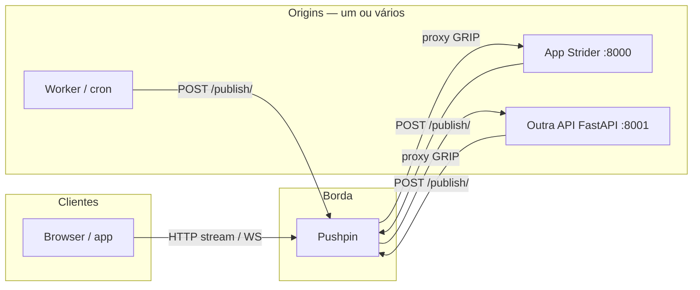

# Pushpin (GRIP) — integração plug-and-play

[Pushpin](https://pushpin.org/) é um proxy open source na borda que mantém ligações HTTP longas e WebSockets, falando com o teu backend via protocolo **GRIP**. O fluxo típico segue o [quickstart](https://pushpin.org/docs/getting-started/#quickstart): o backend responde com `Grip-Hold` + `Grip-Channel`; os clientes ligam-se ao Pushpin; o servidor publica eventos no canal (CLI `pushpin-publish` ou HTTP POST no controlo).

O Strider **não** embute o binário Pushpin: continua a ser um serviço à parte (Docker, sistema, etc.). O framework oferece:

- **Respostas GRIP** — `grip_stream_response`, `grip_stream_headers`, `grip_response_hold_headers`, `merge_grip_into_response_headers`.
- **Publicação HTTP** — `publish_http_stream`, `publish_pushpin_items`, `build_http_stream_item` (sem dependência extra: `urllib` + `asyncio`).
- **Settings** — `pushpin_publish_url`, `pushpin_publish_timeout`, `pushpin_default_channel_prefix`, `pushpin_enabled` ([Settings](02-settings.md)).

## Contrato entre serviços (o que importa em qualquer stack)

Independentemente de seres Strider, FastAPI “puro”, Django ou outro processo:

1. **Subscrição** — a resposta HTTP que o Pushpin recebe do *origin* inclui os cabeçalhos GRIP (no mínimo `Grip-Hold: stream` e `Grip-Channel: <nome-exacto-do-canal>`).
2. **Publicação** — qualquer processo com rede para o **control port** do Pushpin (por omissão `5561`, endpoint `/publish/`) pode enviar JSON com `items[].channel` **igual** ao valor de `Grip-Channel`.

Ou seja: **o canal é a chave de integração**. Vários sistemas cooperam desde que concordem no **nome completo do canal** e na **URL de publish** (normalmente a mesma instância Pushpin).



## Uso comum (uma só app Strider)

1. **Pushpin** — ficheiro `routes` a encaminhar tráfego para a app (ex.: `* localhost:8000`). Ver [configuração](https://pushpin.org/docs/getting-started/#configuration-basics).
2. **Strider** — `.env` opcional:

```bash
PUSHPIN_ENABLED=true
PUSHPIN_PUBLISH_URL=http://127.0.0.1:5561/publish/
PUSHPIN_DEFAULT_CHANNEL_PREFIX=myapp
```

3. **Rota** que segura a ligação (HTTP stream):

```python
from fastapi import APIRouter
from strider import grip_stream_response, publish_http_stream, qualify_channel_from_settings

router = APIRouter()

@router.get("/stream/{room}")
async def stream_room(room: str):
    ch = qualify_channel_from_settings(f"room-{room}")
    return grip_stream_response(ch, content="")
```

4. **Publicar** a partir de outra rota, worker ou tarefa na mesma app:

```python
await publish_http_stream(
    qualify_channel_from_settings("room-lobby"),
    "hello there\n",
)
```

Os clientes devem abrir o stream **através do Pushpin** (ex.: `http://pushpin-host:7999/...` se o proxy estiver nesse host/porta), não directamente no uvicorn, para o GRIP ser interpretado na borda.

## Vários sistemas (Strider + outra API FastAPI, ou mais)

### Cenário A — Um Pushpin, vários *origins* por caminho

No ficheiro `routes`, usa condições mais específicas antes do *catch-all*. Exemplo com prefixo de URL (parâmetros `path_beg` e `path_rem` — ver [Configuration — Routes](https://pushpin.org/docs/configuration/#routes)):

```text
path_beg=/api/strider,path_rem=13 localhost:8000
path_beg=/api/events,path_rem=12 localhost:8001
* localhost:8000
```

Assim, pedidos cujo path começa por `/api/strider` vão para a app na porta `8000` com esse prefixo removido no proxy (ajusta `path_rem` ao comprimento exacto do prefixo que queres retirar). O mesmo para `/api/events` → `8001`. A última linha encaminha o resto para o Strider (ou outro *default*).

Cada serviço implementa as suas rotas; o cliente fala sempre com o host/porta **do Pushpin**, não directamente com cada uvicorn em produção.

### Cenário B — Strider mantém o stream; outra FastAPI só publica

Muito frequente: a app principal (Strider) expõe `GET /stream/{id}` com `grip_stream_response` + `qualify_channel_from_settings`. Um **microserviço** FastAPI separado (pagamentos, notificações, ETL) **não precisa** do pacote `strider` para publicar: basta fazer POST para o mesmo `PUSHPIN_PUBLISH_URL` com o **mesmo nome de canal** que a rota Strider colocou em `Grip-Channel`.

**Na app Strider** (prefixo `myapp`):

- Canal lógico `alerts-42` → `Grip-Channel: myapp.alerts-42` (via `qualify_channel_from_settings`).

**Na outra FastAPI** (Python, sem Strider):

- Usar `httpx` ou `requests` para POST em `http://127.0.0.1:5561/publish/` com corpo:

```json
{
  "items": [
    {
      "channel": "myapp.alerts-42",
      "formats": { "http-stream": { "content": "evento pronto\n" } }
    }
  ]
}
```

O canal **`myapp.alerts-42`** tem de coincidir byte a byte com o que a rota Strider envia em `Grip-Channel`. Por isso convém documentar internamente a convenção: `{prefix}.{domínio}.{id}`.

### Cenário C — Duas apps em FastAPI; uma usa Strider

- **Serviço 1 (Strider):** `grip_stream_response` + `publish_http_stream` + settings `PUSHPIN_DEFAULT_CHANNEL_PREFIX=strider`.
- **Serviço 2 (FastAPI):** rotas com cabeçalhos GRIP manuais (equivalente ao [quickstart](https://pushpin.org/docs/getting-started/#quickstart)) e publicação via HTTP ou `pushpin-publish` na CLI.

Exemplo mínimo de cabeçalhos na segunda app (Starlette/FastAPI):

```python
from starlette.responses import Response

@router.get("/live")
async def live():
    return Response(
        content="",
        media_type="text/plain; charset=utf-8",
        headers={
            "Grip-Hold": "stream",
            "Grip-Channel": "billing.invoices",  # mesmo nome nas publicações
        },
    )
```

### Convenções para não degradar nem misturar fluxos

- **Prefixo por produto ou tenant** — `PUSHPIN_DEFAULT_CHANNEL_PREFIX` no Strider; na outra stack, prefixar manualmente o mesmo valor (ou ler da mesma variável de ambiente partilhada).
- **Um Pushpin por ambiente** — dev/staging/prod com `PUSHPIN_PUBLISH_URL` distinto; evita publicar em canais do ambiente errado.
- **Publish é “fire and forget”** — se o microserviço falhar ao publicar, os subscritores não recebem o evento; trata erros (`PushpinPublishError` no Strider) e retries onde fizer sentido.
- **Não duplicar lógica de canal** — define uma função partilhada ou constantes de contrato (ex.: módulo `channels.py` num pacote interno comum) se Strider e FastAPI forem repositórios diferentes.

## Customização

- **Cabeçalhos extra** — `grip_stream_headers(..., extra={"Grip-Set-Meta": "..."})` ou `merge_grip_into_response_headers(json_response, grip)`.
- **Vários itens** — `publish_pushpin_items([build_http_stream_item("a", "x"), ...])` com payload alinhado à [API de publish](https://pushpin.org/docs/getting-started/#quickstart).
- **URL/timeout** — argumentos `url=` / `timeout=` nas funções `publish_*` sobrepõem as settings (útil em testes ou quando um worker usa outro cluster Pushpin).

## Referência

- [Pushpin — Getting started](https://pushpin.org/docs/getting-started/#quickstart)
- [Pushpin — Configuration / Routes](https://pushpin.org/docs/configuration/#routes)
- [Repositório](https://github.com/fastly/pushpin)
