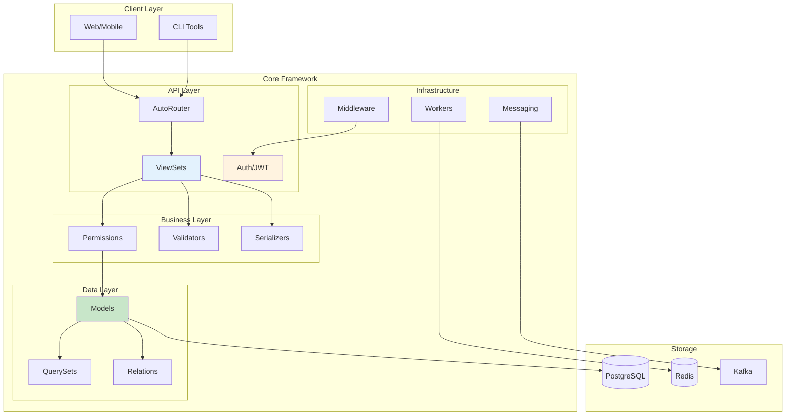

# Core Framework

Framework estilo Django para FastAPI. Models, ViewSets, Auth, Admin — baterias incluídas.

## Arquitetura



## Filosofia Plug-and-Play

Configure no Settings, tudo é auto-configurado:

```python
class AppSettings(Settings):
    # Auth - auto-configurado
    user_model: str = "src.apps.users.models.User"
    
    # Kafka - auto-configurado
    kafka_enabled: bool = True
    
    # Tasks - auto-configurado
    task_enabled: bool = True
    
    # Multi-tenancy - auto-configurado
    tenancy_enabled: bool = True
```

**Zero chamadas explícitas**: Você NÃO precisa chamar `configure_auth()`, `configure_kafka()`, etc.

## Instalação

```bash
pipx install core-framework
core init my-api && cd my-api
core run
# → http://localhost:8000/docs
```

## Documentação

### Começando

| Doc | Descrição |
|-----|-----------|
| [Quickstart](01-quickstart.md) | Primeira API em 5 minutos |
| [Settings](02-settings.md) | Sistema de configuração plug-and-play |
| [Models](03-models.md) | Modelos de banco de dados |
| [ViewSets](04-viewsets.md) | Endpoints CRUD |

### Autenticação

| Doc | Descrição |
|-----|-----------|
| [Auth](05-auth.md) | Autenticação JWT |
| [Auth Backends](06-auth-backends.md) | Backends customizados |
| [CLI](07-cli.md) | Referência de comandos |
| [Permissions](08-permissions.md) | Controle de acesso |

### Camada de Dados

| Doc | Descrição |
|-----|-----------|
| [Fields](10-fields.md) | Todos os tipos de campos |
| [Relations](11-relations.md) | Relacionamentos |
| [QuerySets](12-querysets.md) | Queries estilo Django |
| [Serializers](13-serializers.md) | Schemas de Input/Output |
| [Validators](14-validators.md) | Validação de dados |

### Infraestrutura

| Doc | Descrição |
|-----|-----------|
| [Middleware](20-middleware.md) | Hooks de request/response |
| [Database Replicas](21-replicas.md) | Separação read/write |
| [Soft Delete](22-soft-delete.md) | Deleção lógica |
| [Routing](23-routing.md) | Roteamento de URLs |
| [Dependencies](24-dependencies.md) | Injeção de dependências |

### Avançado

| Doc | Descrição |
|-----|-----------|
| [Messaging](30-messaging.md) | Integração Kafka/Redis |
| [Workers](31-workers.md) | Workers em background |
| [Tenancy](32-tenancy.md) | Multi-tenant |
| [Choices](33-choices.md) | TextChoices/IntegerChoices |
| [Exceptions](34-exceptions.md) | Tratamento de erros |
| [DateTime](35-datetime.md) | Tratamento de timezone |
| [Security](36-security.md) | Boas práticas de segurança |
| [Storage](37-storage.md) | Armazenamento de arquivos (local / Google Cloud Storage) e uso no Admin |

### Referência

| Doc | Descrição |
|-----|-----------|
| [Admin](40-admin.md) | Painel administrativo |
| [Migrations](41-migrations.md) | Migrations de banco |

## Estrutura do Projeto

```
my-api/
├── src/
│   ├── settings.py      # Toda configuração aqui
│   ├── main.py          # Entry point da app
│   └── apps/
│       ├── models.py    # Imports de models (barrel)
│       └── items/
│           ├── models.py
│           ├── views.py
│           └── routes.py
├── migrations/
├── .env
└── pyproject.toml
```

## Exemplo Mínimo

```python
# src/settings.py
from core.config import Settings, configure

class AppSettings(Settings):
    app_name: str = "Minha API"

settings = configure(settings_class=AppSettings)
```

```python
# src/apps/items/models.py
from core import Model, Field
from sqlalchemy.orm import Mapped

class Item(Model):
    __tablename__ = "items"
    id: Mapped[int] = Field.pk()
    name: Mapped[str] = Field.string(max_length=200)
```

```python
# src/apps/items/views.py
from core import ModelViewSet
from .models import Item

class ItemViewSet(ModelViewSet):
    model = Item
```

```python
# src/main.py
from core import CoreApp, AutoRouter
from src.apps.items.routes import router as items_router

api = AutoRouter(prefix="/api/v1")
api.include_router(items_router)

app = CoreApp(routers=[api])
```

## Exemplo Completo com Auto-Configuração

```python
# src/settings.py
from core.config import Settings, PydanticField, configure

class AppSettings(Settings):
    # ══════════════════════════════════════════════════════════════════
    # Aplicação
    # ══════════════════════════════════════════════════════════════════
    app_name: str = "Minha API"
    app_version: str = "1.0.0"
    
    # ══════════════════════════════════════════════════════════════════
    # Auth (auto-configurado quando user_model definido)
    # ══════════════════════════════════════════════════════════════════
    user_model: str = "src.apps.users.models.User"
    models_module: str = "src.apps"
    auth_password_hasher: str = "argon2"
    
    # ══════════════════════════════════════════════════════════════════
    # Kafka (auto-configurado quando kafka_enabled=True)
    # ══════════════════════════════════════════════════════════════════
    kafka_enabled: bool = True
    kafka_bootstrap_servers: str = "kafka:9092"
    avro_default_namespace: str = "com.mycompany.events"
    
    # ══════════════════════════════════════════════════════════════════
    # Tasks (auto-configurado quando task_enabled=True)
    # ══════════════════════════════════════════════════════════════════
    task_enabled: bool = True
    task_worker_concurrency: int = 8
    
    # ══════════════════════════════════════════════════════════════════
    # Multi-tenancy
    # ══════════════════════════════════════════════════════════════════
    tenancy_enabled: bool = True
    tenancy_field: str = "workspace_id"
    
    # ══════════════════════════════════════════════════════════════════
    # Middleware
    # ══════════════════════════════════════════════════════════════════
    middleware: list[str] = [
        "timing",
        "request_id",
        "tenant",
        "auth",
        "logging",
    ]
    
    # ══════════════════════════════════════════════════════════════════
    # Admin
    # ══════════════════════════════════════════════════════════════════
    admin_site_title: str = "Minha Empresa"
    admin_primary_color: str = "#10B981"
    
    # ══════════════════════════════════════════════════════════════════
    # Campos customizados
    # ══════════════════════════════════════════════════════════════════
    stripe_api_key: str = PydanticField(default="", description="Stripe API Key")

# Configura TUDO automaticamente
settings = configure(settings_class=AppSettings)
```

## Comandos Rápidos

```bash
core init my-api          # Criar projeto
core init my-api --minimal # Projeto mínimo
core makemigrations       # Gerar migrations
core migrate              # Aplicar migrations
core run                  # Iniciar servidor
core createsuperuser      # Criar usuário admin
core kafka worker --all   # Executar workers
```

## Links

- [GitHub](https://github.com/your-org/core-framework)
- [PyPI](https://pypi.org/project/core-framework/)
- [Changelog](CHANGELOG.md)
